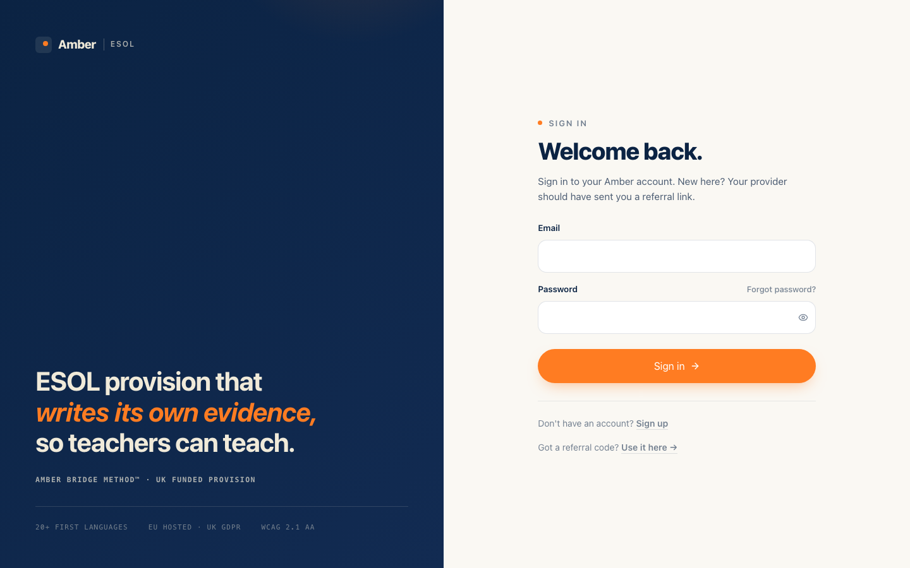
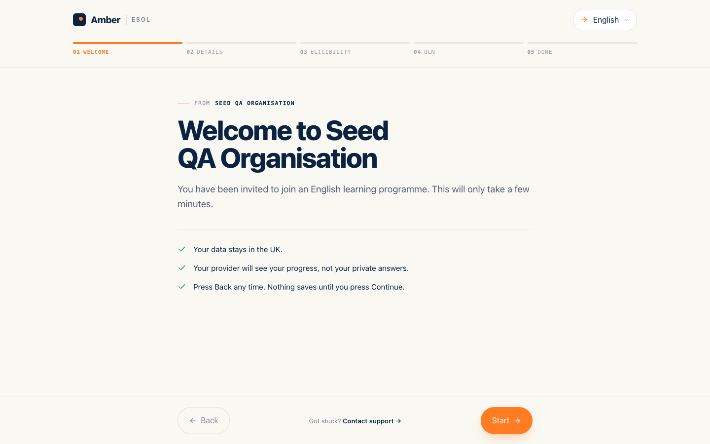
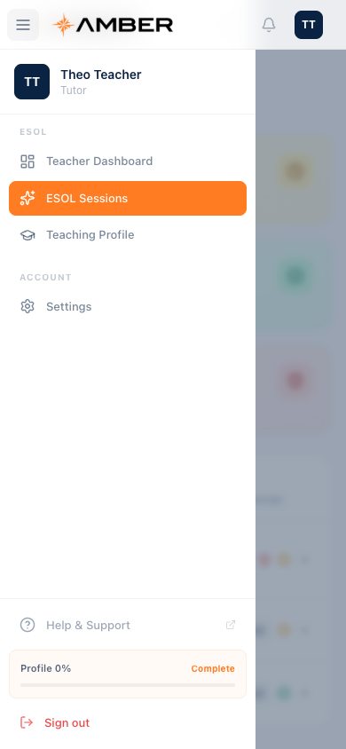
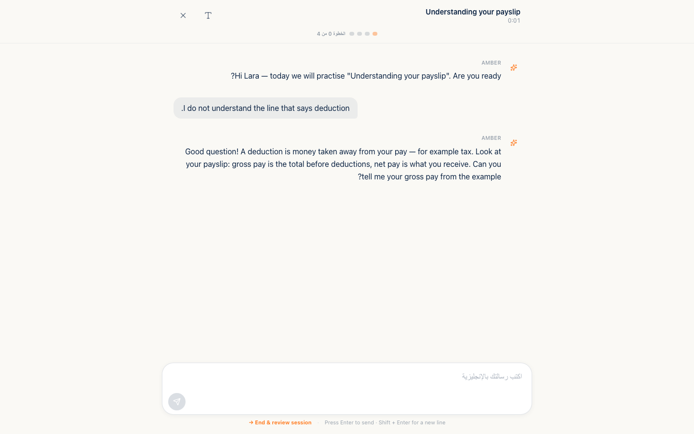
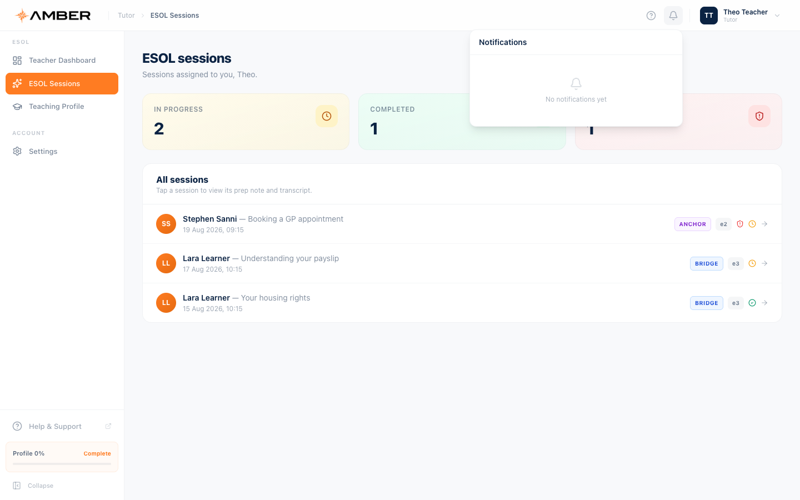

# Amber ESOL Getting Started Guide

_This chapter is for everyone. It explains what Amber is, how to sign
in, how to find your way around, how the platform speaks your
language, and what every specialist term in the other chapters means.
Read it once, then keep it nearby as the glossary._

> **The idea in one line:** Amber is an AI supported English learning
> platform where learners practise with an AI tutor, teachers focus on
> the learners who need a human, and the paperwork that funded
> provision requires writes itself as evidence, honestly, in the
> background.

---

## 1. What Amber is

Amber ESOL is a platform for councils, colleges, and charities that
run funded English courses for adults whose first language is not
English. Learners practise real life scenarios with an AI tutor that
supports them in their own language. The platform records progress
and hours automatically, in the exact shape that UK funding rules
expect, and keeps a person in charge of every judgement that matters.

Four kinds of people use it, and each has their own guide:

| Role            | Who they are                                  | Where they land after sign in            | Their guide                               |
| --------------- | --------------------------------------------- | ---------------------------------------- | ----------------------------------------- |
| **Learner**     | An adult learning English with their provider | Their learning home page                 | [Learner Guide](04-learner.md)            |
| **Teacher**     | An ESOL teacher working across learners       | The teacher dashboard and priority queue | [Teacher Guide](03-teacher.md)            |
| **Org admin**   | The provider's administrator                  | The organisation dashboard               | [Org Admin Guide](02-org-admin.md)        |
| **Amber admin** | Amber's own platform staff                    | The platform overview                    | [Platform Admin Guide](01-amber-admin.md) |

---

## 2. Signing in and out

**How to get here:** open the platform and press **Sign in**, or go
straight to the login page.

**Step by step**

1. Enter your email and password. The eye button shows the password
   while you check it.
2. Press **Sign in**. You land on the home screen for your role, and
   if you were sent to sign in from a deeper page, you return to that
   page instead.

**If the password is wrong** you see "Invalid email or password". The
message is deliberately the same whether the email or the password
was the problem, so nobody can use the login page to discover which
emails have accounts.

**Forgot your password?** Press the **Forgot password?** link, enter
your email, and check your inbox. The page always says the same
thing, "If an account exists for that email, the link is on its way",
for the same privacy reason. The link in the email works once and
expires after one hour. The reset page asks for a new password of at
least 8 characters including an uppercase letter, a number, and a
symbol, and shows a strength meter while you type.

**Staying signed in.** You stay signed in for up to 7 days on the
same browser. After long enough away, the platform asks you to sign
in again and then returns you to the page you were on.

**Signing out.** Open the profile menu at the top right, or scroll to
the bottom of the menu on a phone, and press **Sign out**.

**Good to know:** learners do not create their own accounts from the
login page. Learners join through an invitation link sent by their
organisation, which opens a short wizard in their own language and
ends in the placement assessment. The invitation screen looks like
this, with the language picker in the top corner:

---

## 3. Finding your way around

Every role uses the same shell:

- **The sidebar** on the left lists your screens, grouped under small
  headings. Press **Collapse** at the bottom to shrink it. Your
  profile card and the **Help and Support** link live at the bottom
  of the sidebar.
- **The breadcrumb** across the top always shows where you are.
- **The header icons** at the top right are help, notifications (the
  bell), and your profile menu.

On a phone, the sidebar becomes a drawer behind the menu button at
the top left. Everything is in the same order, with **Sign out** at
the bottom:

Every screen in the platform works at phone size. Tables scroll
sideways inside their cards rather than breaking the page.

---

## 4. Your language, and right to left

Amber is built for people learning English, so the platform never
assumes English.

- **Choosing a language.** The language picker sits in the top corner
  of the invitation wizard. A learner picks their language on their
  very first screen, before anything else, and the choice is
  remembered on that device. Four languages are selectable today,
  English, Arabic, Cantonese, and Turkish, with sixteen more already
  prepared behind the scenes.
- **What follows the choice.** The placement assessment, the session
  preparation screens, the practice session itself, goal setting, and
  the messages inbox all follow the chosen language.
- **Right to left.** Arabic flips the whole layout so it reads
  naturally right to left, as here mid session:

- **Messages arrive translated.** When a teacher writes to a learner,
  the platform translates the message into the learner's first
  language before it is delivered, and the teacher sees a preview of
  that translation before sending.
- **Crisis messages too.** The supportive messages a learner sees if
  they disclose something worrying are written by people, per
  language, in advance. They are never machine generated in the
  moment.

**Good to know:** the learner's first language also shapes the
teaching itself. The AI tutor uses it as a scaffold into English, more
support at Entry 1, almost none by Level 2. That approach is the
Bridge Method, explained in the glossary below.

---

## 5. How the platform talks to you

**The bell.** Every role has the notifications bell in the header. It
shows an orange badge with your unread count, and opens into the ten
newest notifications. Press one to mark it read, or **Mark all
read**. The list refreshes itself about once a minute.

**Toasts.** Small cards appear at the top right after actions, to
confirm a save, a send, or to explain a failure. They disappear on
their own.

**For learners, teacher messages cannot be missed.** A message from
your teacher appears as a banner on your home page, as a note that
opens when you arrive, and as a full screen note before your next
practice session begins. Messages marked **Auto sent** are friendly
automatic check ins that go out on the teacher's behalf when someone
has been away a while; teachers can switch those off.

**Email.** The platform sends email for the moments that matter:
safeguarding alerts go to the safeguarding lead within seconds,
organisations can send a one tap encouragement email in the learner's
own language, and admins are emailed when a learner is ready to move
up a level. Teacher messages currently live in the app only, there is
no email copy, so the in app surfaces above are the ones to trust.

---

## 6. Accessibility

The platform is built to the WCAG 2.1 AA standard, and the practical
things you will notice are these:

- **Touch targets** are at least 44 pixels, so buttons are easy to
  hit on a phone.
- **Form fields never zoom the page** on iPhones, because text inputs
  are always at least 16 pixels.
- **Keyboard use** works across the platform, with a visible focus
  ring as you tab.
- **Text size in sessions.** The practice session has its own text
  size button that cycles small, medium, and large, for the screen
  where reading comfort matters most.
- **Listen and speak.** Where voice is enabled, learners can press
  **Listen** to hear the tutor's message aloud, and opt in to a
  microphone to speak their answers instead of typing.
- **Screens work small.** Learner pages are usable at 425 pixels
  wide, and the practice session at 375 pixels.

Accessibility work is ongoing; some older administrative screens are
still being brought up to the same bar.

---

## 7. If something goes wrong

| Problem                                          | What to do                                                                                                                  |
| ------------------------------------------------ | --------------------------------------------------------------------------------------------------------------------------- |
| I cannot sign in                                 | Check the email and password. After a reset link expires (one hour), request a new one.                                     |
| My invitation link says it is invalid or expired | Links expire after 30 days by default. Ask your organisation for a fresh one.                                               |
| I did not get the reset email                    | The page will not confirm whether the email has an account; check spam, then ask your admin to confirm the address on file. |
| It signed me out by itself                       | You were away long enough for the session to end. Sign in again and you return to where you were.                           |
| The page looks stuck loading                     | Give it a few seconds; most screens show grey placeholder blocks while data loads.                                          |
| The layout looks wrong in Arabic                 | Tell your provider which screen; the direction flip is per screen and feedback pinpoints the fix.                           |

---

## Glossary

The other four guides use these terms freely. Plain English versions
of all of them live here.

### Levels and assessment

**ESOL.** English for Speakers of Other Languages, the UK term for
English courses taught to adults whose first language is not English.

**E1, E2, E3, L1, L2.** The five UK adult ESOL course levels: Entry
1, Entry 2, Entry 3, Level 1, and Level 2. Entry 1 is the beginner
stage and Level 2 is the most advanced the platform teaches. Every
learner, session, and result carries one of these levels.

**CEFR.** The Common European Framework of Reference for Languages,
an international scale of language ability. Amber maps the UK levels
onto it: E1 is A1, E2 sits between A1 and A2, E3 is A2, L1 is B1,
and L2 is B2.

**Placement assessment.** The 20 question assessment every learner
takes when joining. It adapts once, after the fifth answer, rewriting
the remaining questions to suit the learner, then places them at one
of the five levels with a confidence score. A teacher reviews every
placement result.

### Funding and compliance

**ILR.** Individualised Learner Record, the standard data return that
funded UK education providers submit to government. Amber builds the
ILR rows automatically from real learner and session records.

**ULN.** Unique Learner Number, a ten digit identifier that follows a
learner across UK education systems. It is the key identity field on
funding returns.

**ESFA.** The Education and Skills Funding Agency, the government
body that receives ILR submissions.

**ASF.** The Adult Skills Fund, the pot of government funding that
pays for adult courses such as ESOL. Amber records hours and evidence
in the shape ASF assurance reviews expect, and keeps records for at
least six years.

**GLH.** Guided Learning Hours, the taught hours recorded for each
learner, which funding claims are based on. Amber totals them
automatically from AI tutor time, teacher contact time, and any hours
imported from before the platform.

**Total versus Claimable GLH.** Two figures shown side by side
everywhere hours appear. Total GLH counts everything including AI
tutor time. Claimable GLH excludes AI time and counts only teacher
contact and imported hours, because AI hours are not yet an accepted
basis for a funding claim. Any funding figure must use the claimable
number.

**Teacher contact target.** The funding model assumes teacher contact
sits between 10 and 20 percent of a learner's total hours. Below
that there is too little qualified oversight; above it the cost
advantage of the AI tutor erodes. The platform tracks the ratio and
flags drift.

**MIS.** Management information system, the student record software a
provider already runs, such as ProSolution, Maytas, or EBS. Amber can
push learner records into it so nothing is typed twice.

**Evidence chain.** The audit trail that links every claim about a
learner back to the moment its evidence was created. Records are
written as events happen and can never be edited afterwards, and an
AI judgement only counts as final once a person confirms it.

### RARPA, the progress framework

**RARPA.** Recognising And Recording Progress And Achievement, the
six stage quality framework used to evidence learner progress on
courses that do not end in an exam. Amber generates the evidence for
each stage automatically from real activity.

- **Stage 1, aims.** Who the learner is and what the course sets out
  to achieve.
- **Stage 2, starting point.** The diagnostic assessment recorded at
  enrolment, so later progress has a baseline.
- **Stage 3, objectives.** Individual learning objectives agreed with
  the learner, in their own language, with the agreement itself
  recorded as evidence.
- **Stage 4, ongoing progress.** The running record collected every
  session: scores, vocabulary, skills practised, and how the learner
  responds to correction.
- **Stage 5, the achievement review.** The end of level review. It
  gathers the learner's self assessment, the AI tutor's summary, and
  then two human approvals.
- **Stage 6, next steps.** Where the learner goes after the course,
  always confirmed by a person.

**The Stage 5 two person rule.** A level achievement is only final
after two different people approve it in order: the teacher signs off
first, then the org admin confirms. Both approvals are stamped with
who and when. Nothing the AI scores can become an achievement on its
own.

### The teaching method

**Bridge Method.** Amber's teaching approach: the learner's first
language is used as a scaffold into English rather than being banned.
The share of first language is set by level, from roughly 70 percent
at Entry 1 down to almost none at Level 2, and it reduces as
confidence grows.

**ANCHOR, BRIDGE, IMMERSION.** The three modes a practice session
moves between, decided turn by turn. ANCHOR gives maximum first
language support and switches on when the learner is struggling or
distressed. BRIDGE is the normal mix for the learner's level.
IMMERSION is mostly or entirely English, earned by three strong
answers in a row. The platform never records less support than the
learner actually needed.

**Vocab ledger.** The per learner record of every word met, with a
count of encounters. A word counts as retained once the learner has
met it at least 5 times and produced it correctly in a strong answer,
and once retained it stays retained. Teachers see the ledger split
into retained and in progress.

**Priority bands P1 to P4.** The flag that tells teachers who needs
attention first, recalculated daily. P1 means act now, for example an
open safeguarding alert, two weeks of silence, or three weak sessions
in a row. P2 means act within a week. P3 means act within two weeks.
P4 means on track, nothing needed.

### Safety

**DSL.** Designated Safeguarding Lead, the named person responsible
for acting on safeguarding concerns. When the platform detects a
possible disclosure during a session it alerts the DSL by email
within seconds, while the learner immediately sees a supportive,
human written message with real helplines. The platform never handles
the concern inside the lesson and never decides on its own; a person
always does.

---

_You are ready. Pick your guide: [Learner](04-learner.md),
[Teacher](03-teacher.md), [Org Admin](02-org-admin.md), or
[Platform Admin](01-amber-admin.md)._
