# Amber ESOL Platform Admin Guide

_This guide is for Amber staff who run the platform itself. It covers
every organisation, every teacher, safeguarding oversight, funding
evidence, compliance rules, and the background machinery that keeps the
platform honest. Every picture comes from the real system._

> **The idea in one line:** organisations teach and learners practise,
> but the duties that protect everyone, safeguarding response, funding
> integrity, and the audit trail, live at this level. This module is
> where those duties are done.

---

## Quick reference, the 10 things you will do most

| I want to                                 | Where to go                      |
| ----------------------------------------- | -------------------------------- |
| See the whole platform at a glance        | Sidebar, **Overview**            |
| Add or manage a client organisation       | Sidebar, **Organisations**       |
| Approve or revoke an ESOL teacher         | Sidebar, **ESOL Teachers**       |
| Act on a safeguarding alert               | Sidebar, **Safeguarding**        |
| Edit the crisis messages learners see     | Sidebar, **Response texts**      |
| Check teacher workload                    | Sidebar, **Teacher utilisation** |
| Export the ILR funding file               | Sidebar, **Reports**             |
| See claimable versus total learning hours | Sidebar, **GLH analytics**       |
| Change ILR, RARPA, or routing rules       | Sidebar, **Compliance config**   |
| Investigate what happened and when        | Sidebar, **Audit search**        |

---

## 1. Overview, the whole platform on one screen

**What it is for:** a live picture of every organisation: learners,
learning hours, and revenue for the current period.

**How to get here:** sign in as an Amber admin. You land here. Sidebar,
**Overview**.

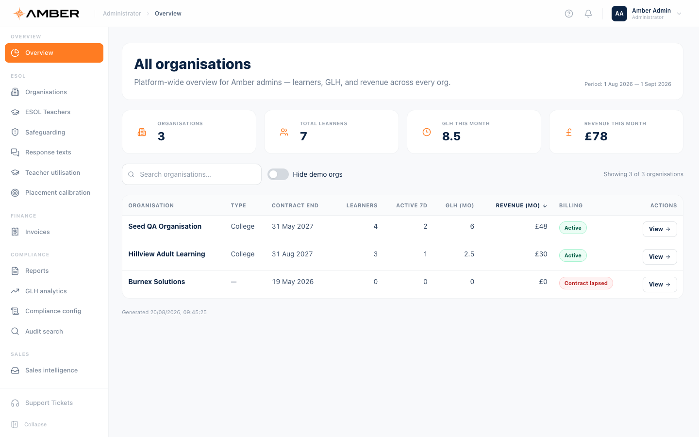

What you see:

1. **Four platform totals.** Organisations, total learners, GLH this
   month, and revenue this month.
2. **The organisations table.** One row per client with type, contract
   end date, learner count, learners active in the last 7 days, monthly
   GLH, monthly revenue, and a billing status chip. **Contract lapsed**
   and **No contract** appear in the billing column so a commercial
   problem is visible the moment you sign in.
3. **Search and the demo toggle.** Search by name, and flip **Hide demo
   orgs** to see only paying clients.

Press **View** on any row to open that organisation in full.

---

## 2. Organisations

**What it is for:** provisioning new clients and managing existing
ones.

**How to get here:** sidebar, **Organisations**.

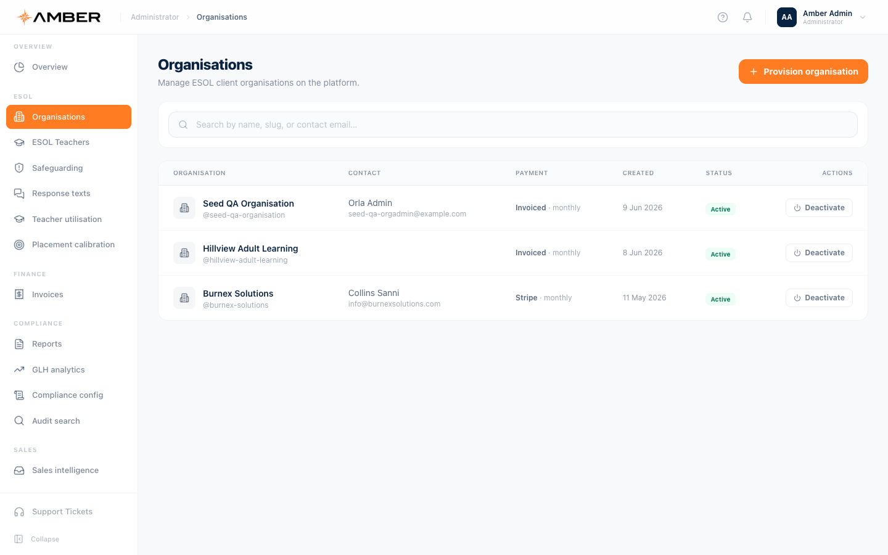

Each row shows the organisation, its admin contact, the payment model
(invoiced or Stripe, with the billing cycle), the created date, and an
active status chip.

- **Provision organisation** opens the form for a new client. It
  creates the organisation and its first org admin account in one step.
- **Deactivate** suspends an organisation. Its people can no longer
  sign in, but nothing is deleted and the audit trail stays intact.
  Deactivating is reversible; use it for lapsed contracts rather than
  asking for anything to be removed.

### An organisation in detail

Press a row to open the full record:

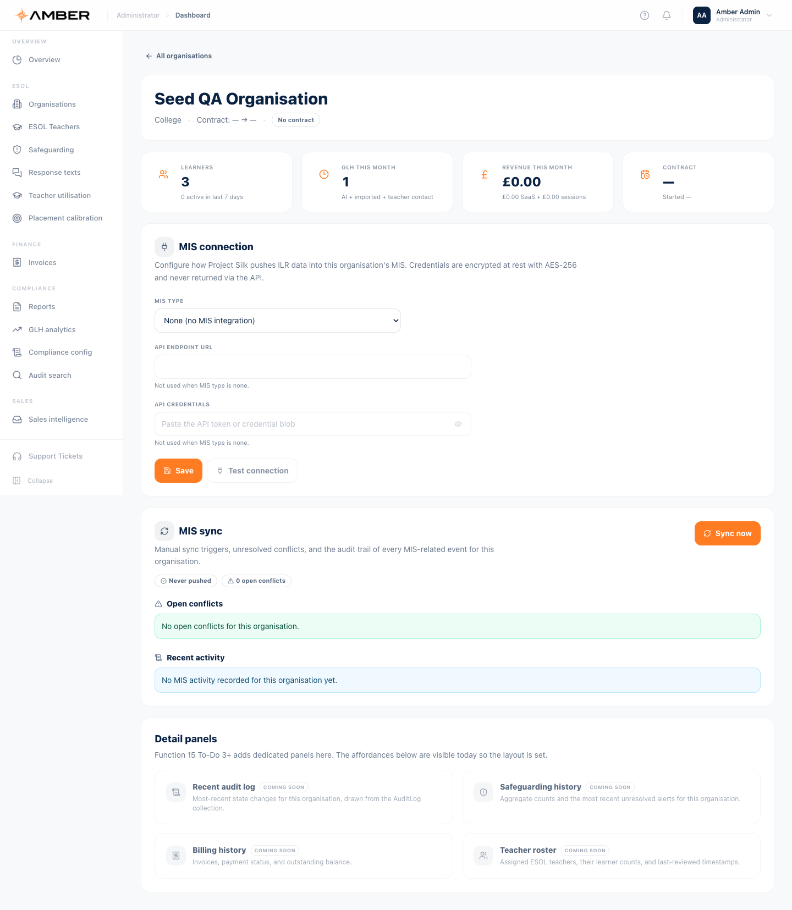

Top to bottom:

1. **The header.** Name, type, contract dates, and a contract status
   chip.
2. **Four cards.** Learners (with 7 day activity), GLH this month,
   revenue this month, and the contract summary.
3. **MIS connection.** How the platform pushes ILR data into the
   client's management information system. Pick the MIS type, paste the
   endpoint and credentials, then **Save**. Credentials are encrypted
   at rest with AES 256 and are never returned by the API, so once
   saved they cannot be read back out by anyone, including you. Press
   **Test connection** to prove the details work before relying on
   them.
4. **MIS sync.** The push history for this client: when data was last
   pushed, any open conflicts, and a **Sync now** button for a manual
   push. Conflicts appear here when the MIS rejects or disputes a
   record, and each one must be resolved by a person.
5. **Detail panels.** Placeholders for the audit log, safeguarding
   history, billing history, and teacher roster panels. These are
   labelled coming soon in the current build.

---

## 3. ESOL Teachers, the approval gate

**What it is for:** deciding who is allowed to deliver ESOL sessions on
the platform. A teacher account can exist, but until you approve it
here, it cannot teach.

**How to get here:** sidebar, **ESOL Teachers**.

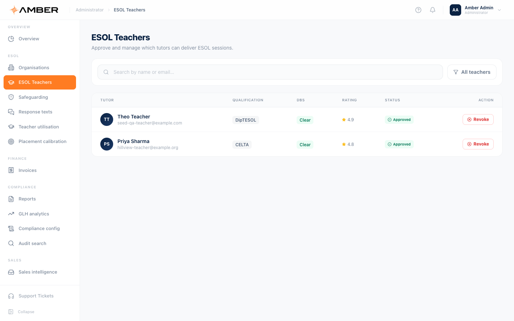

Each row shows the tutor, their qualification, DBS status, rating, and
approval status.

**Step by step, approving a teacher**

1. Check the qualification column. A dash means none recorded yet.
2. Check the DBS column. **Not set** shows in red because a missing
   DBS check is a safeguarding matter, not a paperwork detail.
3. If everything is in order, press **Approve**. The teacher can now
   be assigned learners and deliver sessions.
4. To withdraw approval later, press **Revoke**. The account remains,
   but the teacher can no longer act on learners.

**Good to know:** approval is deliberately a platform level decision,
not an organisation level one. An org admin can invite a teacher, but
only Amber can switch them on. That keeps one consistent vetting bar
across every client.

---

## 4. Safeguarding, the most important queue on the platform

**Why this matters:** during AI practice sessions the platform watches
for signs that a learner may be at risk: self harm, domestic abuse,
radicalisation, concern about a child, exploitation, or a mental
health crisis. When something is detected, the learner immediately
receives a supportive message with real helpline numbers, the session
carries on if they want it to, and an alert lands in this queue. The
platform never contacts emergency services and never decides on its
own. A person, the designated safeguarding lead, must review every
alert. This screen is where that duty is discharged.

**How to get here:** sidebar, **Safeguarding**. The count of open
alerts is shown next to the page title.

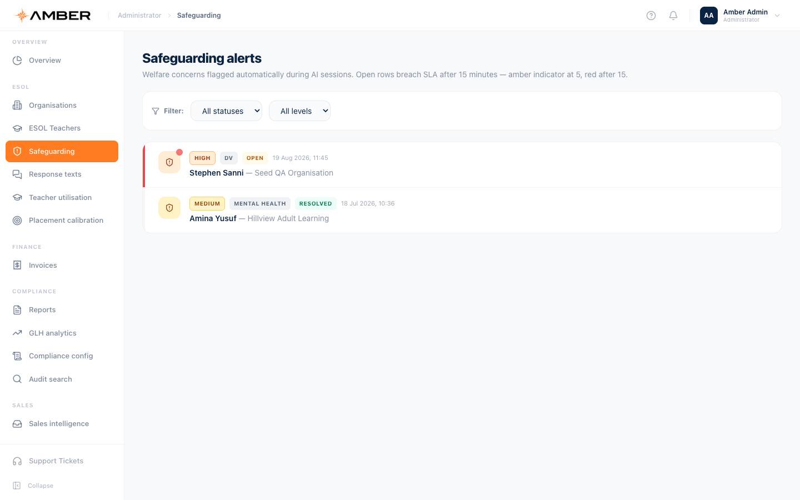

Each alert row shows:

- **The level chip.** HIGH means act now.
- **The category chip.** In the picture, DV marks a domestic abuse
  trigger. Categories match the response texts in section 5.
- **The status chip.** OPEN until a person records an outcome.
- **Who and where.** The learner's name and their organisation, plus
  the time the alert was raised.

**The clock is running.** Open alerts breach their service level after
15 minutes. The row indicator turns amber at 5 minutes and red at 15.
An alert that has gone red is overdue for human attention and should
be picked up before anything else on the platform.

Filter by status or level to work the queue. Use **All statuses** to
review past alerts and confirm nothing was left open.

### Acting on an alert

Press an alert to open it:

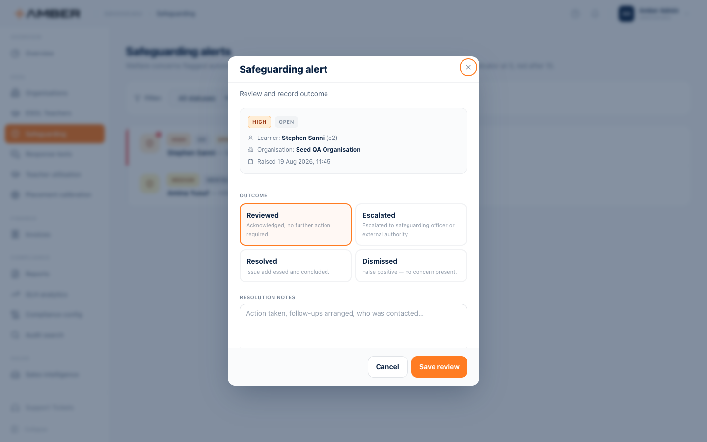

The panel shows the level, status, the learner and their level, the
organisation, and when the alert was raised. To close the loop you
record an outcome. There are exactly four, and choosing honestly
matters because this record is the evidence of how the duty was met:

| Outcome       | When to choose it                                                                                                                                                     |
| ------------- | --------------------------------------------------------------------------------------------------------------------------------------------------------------------- |
| **Reviewed**  | You looked at it, spoke to whoever you needed to, and no further action is required.                                                                                  |
| **Escalated** | You passed it to the safeguarding officer at the learner's organisation, or to an external authority. Use this whenever the concern is real and beyond a quick check. |
| **Resolved**  | The issue was addressed and concluded, for example support was arranged and confirmed.                                                                                |
| **Dismissed** | A false positive. The trigger fired but there is no concern present.                                                                                                  |

Write what you did in **Resolution notes**: the action taken, any
follow ups arranged, and who was contacted. Then press **Save
review**. The outcome, your notes, your identity, and the timestamp
all enter the append only audit trail.

**Scenarios to be ready for:**

- **A high alert arrives out of hours.** The SLA clock does not pause.
  Whoever holds the safeguarding duty should be reachable, and the
  response texts (section 5) mean the learner has already been given
  crisis contacts in the moment, before any person responds.
- **You are not sure whether it is real.** Choose **Escalated** and
  let the organisation's safeguarding officer decide. Dismissing a
  genuine concern is the failure mode this queue exists to prevent;
  escalating a false positive costs only a phone call.
- **The same learner triggers more than once.** Each alert is its own
  record and each needs its own outcome. A repeat pattern is itself
  a signal worth escalating.
- **What the platform stores.** The alert holds the category, level,
  time, and a cryptographic fingerprint of the message that triggered
  it. Treat everything on this screen as strictly confidential and
  keep the detail in your notes factual and minimal.

---

## 5. Response texts, the words a learner sees in a crisis

**What it is for:** when a disclosure is detected mid session, the
learner instantly sees a supportive message. Those messages are
written here, by people, in advance. They are served from memory and
are never generated live by the AI, so what a learner in crisis reads
has always been reviewed by a human being.

**How to get here:** sidebar, **Response texts**.

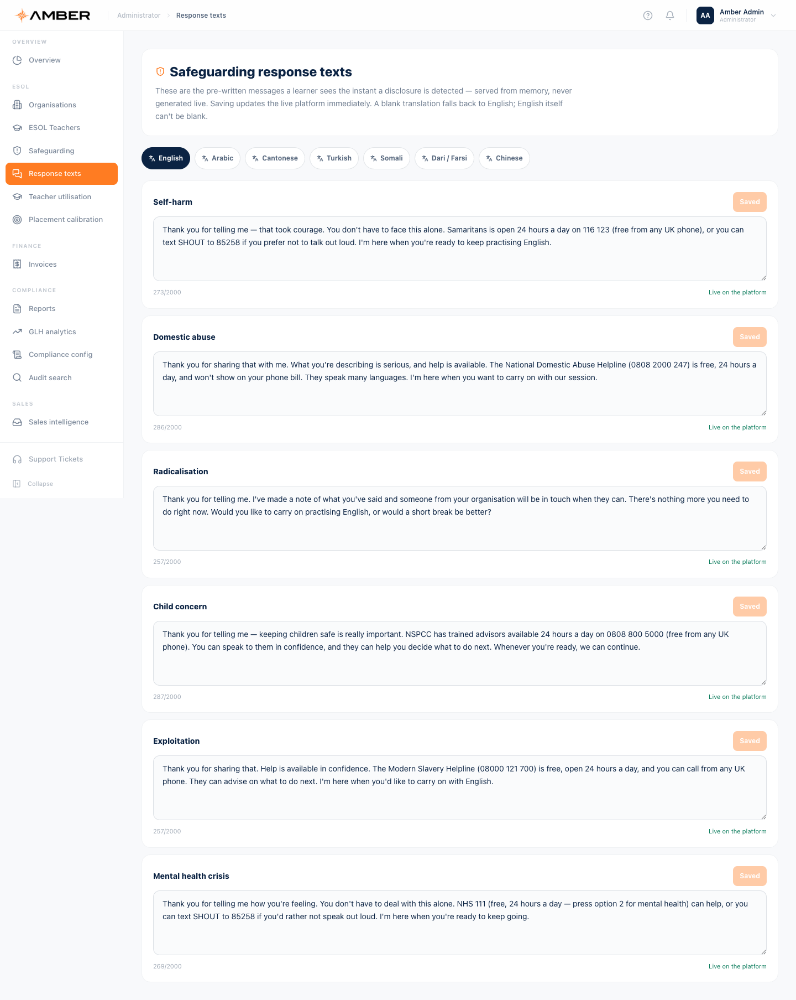

There is one message per category: self harm, domestic abuse,
radicalisation, child concern, exploitation, and mental health crisis.
Each carries the relevant real helpline (Samaritans, the National
Domestic Abuse Helpline, NSPCC, the Modern Slavery Helpline, NHS 111)
and closes by inviting the learner to continue when ready.

**Step by step, editing a message**

1. Pick the language tab. English is the source text; the other tabs
   (Arabic, Cantonese, Turkish, Somali, Dari and Farsi, Chinese) hold
   translations so learners read the message in their own language.
2. Edit the text. The counter shows the 2000 character limit.
3. Press **Save**. Saving updates the live platform immediately, with
   no deploy and no restart.

**Good to know:** a blank translation falls back to English rather
than showing nothing, and English itself cannot be blank. The badge
under each box confirms the text is live on the platform.

**Treat edits here with the same care as a code release.** These words
reach people at their lowest moment. Keep helpline numbers exactly
right, keep the tone warm and unhurried, and have a second person read
any change before you save it.

---

## 6. Teacher utilisation

**What it is for:** spotting overloaded and underused teachers across
every organisation before it becomes a problem.

**How to get here:** sidebar, **Teacher utilisation**.

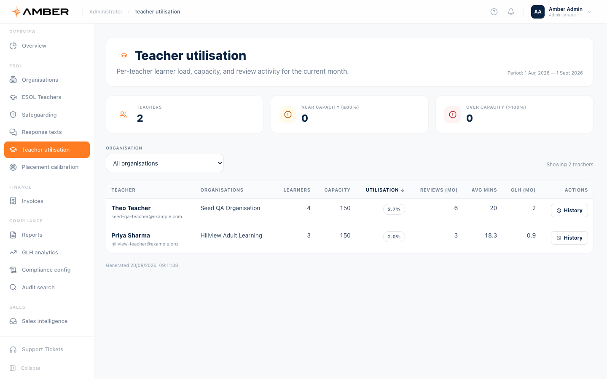

The cards count teachers, teachers near capacity (80 percent or
more), and teachers over capacity (above 100 percent). The table shows
each teacher's organisations, learner count, capacity, utilisation
percentage, reviews this month, average review minutes, and teaching
hours this month. Filter by organisation, and press **History** for a
teacher's month by month record.

**Good to know:** utilisation feeds from the same reviews teachers log
in their own module, so a teacher who works but does not log reviews
will look idle here. If a number looks wrong, that is the first thing
to check.

---

## 7. Placement calibration, proving the AI places learners correctly

**Why this matters:** the platform's placement assessment assigns each
new learner an ESOL level. Funding and teaching decisions rest on that
level, so the assessment must be proven against human judgement before
it is trusted, and proven again every time the question bank changes.
This screen runs that protocol.

**How to get here:** sidebar, **Placement calibration**.

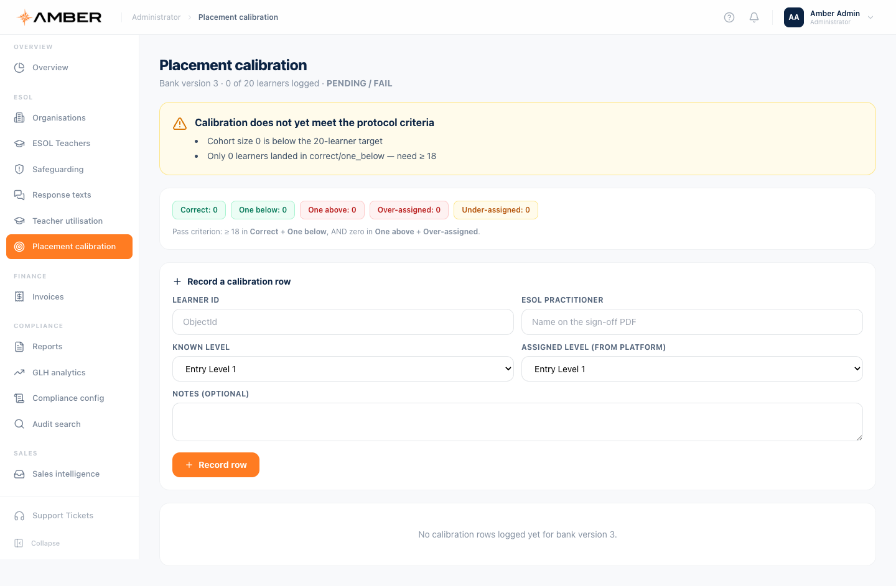

The header shows the current question bank version, progress through
the cohort, and the verdict: PENDING, PASS, or FAIL.

**The protocol, in plain terms**

1. Take at least 20 learners whose true level is already known to a
   qualified ESOL practitioner.
2. For each learner, record a calibration row: the learner, the
   practitioner's name as it appears on the sign off PDF, the known
   level, the level the platform assigned, and optional notes.
3. Each row lands in one of five buckets: **Correct**, **One below**,
   **One above**, **Over assigned**, and **Under assigned**.
4. The bank passes only when at least 18 of the 20 land in Correct or
   One below, and zero land in One above or Over assigned.

The asymmetry is deliberate. Placing a learner one level below their
ability costs a little time and is caught quickly. Placing them above
their ability sets them up to fail and risks claiming funding for
provision they cannot access, so even one over assignment fails the
bank.

**Good to know:** the yellow banner lists exactly which criteria are
unmet, as in the picture. A new bank version resets the cohort and the
protocol starts again from zero.

---

## 8. Invoices

**What it is for:** invoice management across every organisation in
one place.

**How to get here:** sidebar, **Invoices**.

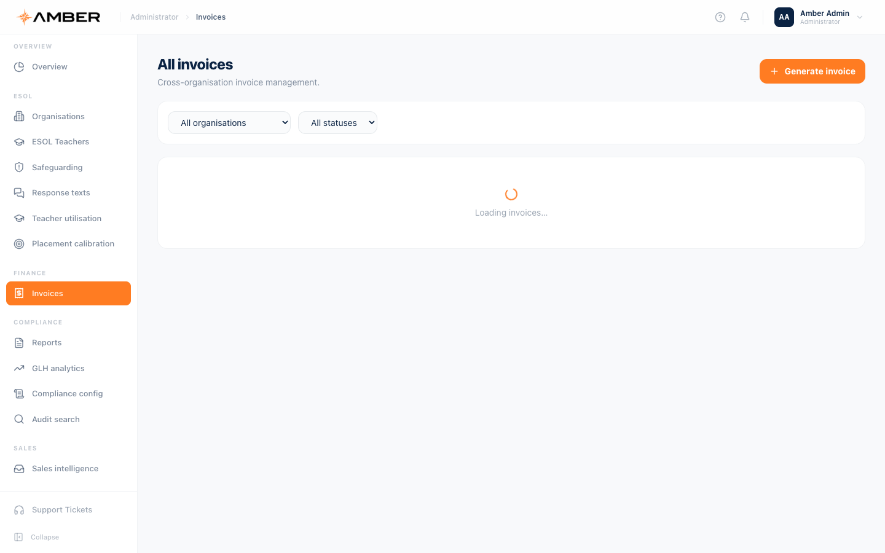

Filter by organisation and status, or press **Generate invoice** to
raise one manually. Organisations on Stripe bill automatically on
their cycle; invoiced clients are managed from here.

---

## 9. Reports, the ILR export

**Why this matters:** this is the file that goes to the funding body.
It contains learner enrolment and delivery data for ESFA funded ESOL
provision: ULN, level, hours delivered, and funding status. Getting it
wrong is not a display bug, it is a compliance incident, so the export
is scoped and checked before anything downloads.

**How to get here:** sidebar, **Reports**.

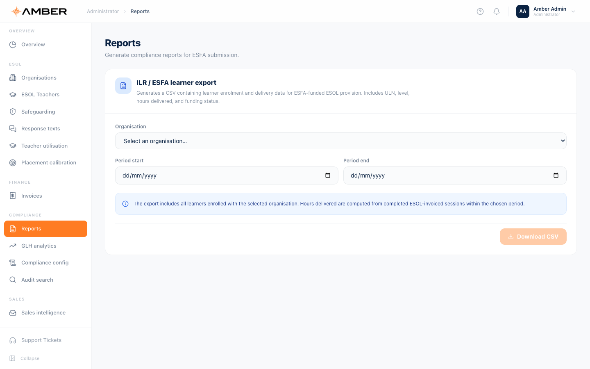

**Step by step**

1. Select the organisation. The export covers all learners enrolled
   with that organisation.
2. Set the period start and end dates.
3. Press **Download CSV**. The button stays disabled until the
   selections are complete.

**Good to know:** hours delivered are computed from completed sessions
within the chosen period, not from anything self reported. Before
submitting a return, sanity check the totals against **GLH analytics**
(section 10) for the same window; the numbers should tell the same
story.

---

## 10. GLH analytics, total versus claimable

**What it is for:** guided learning hours across the platform, split
by where they came from: AI tutor practice, hours logged before the
platform, and teacher contact time.

**How to get here:** sidebar, **GLH analytics**.

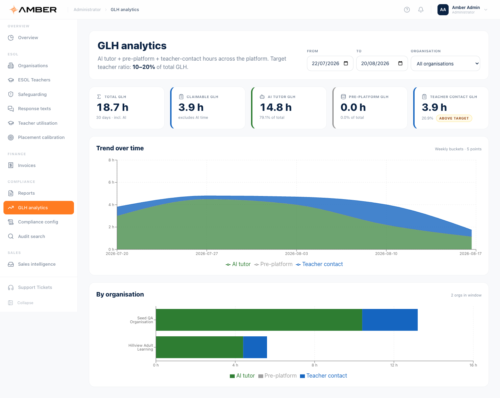

The five cards are the heart of it:

- **Total GLH.** Everything, including AI practice time.
- **Claimable GLH.** The subset that excludes AI time. This is the
  number that matters for funding claims, because AI practice hours
  are not claimable guided learning. The two cards exist side by side
  precisely so nobody ever mistakes one for the other.
- **AI tutor GLH**, **Pre platform GLH**, and **Teacher contact GLH**
  show the mix, each with its share of the total.

The platform targets teacher contact at 10 to 20 percent of total
GLH. The teacher contact card carries an **ABOVE TARGET** or below
target badge so drift is visible at a glance. Below it, the trend
chart shows the mix week by week, and the organisation chart breaks
the same numbers down per client. Filter by date range and
organisation at the top.

---

## 11. Compliance config, the rules of the game

**Why this matters:** the rules that drive ILR exports, RARPA
evaluation, and ASF postcode routing change from academic year to
academic year. This screen versions those rules so a change is
deliberate, attributed, reversible, and visible in the audit log,
rather than a silent edit somewhere in the code.

**How to get here:** sidebar, **Compliance config**.

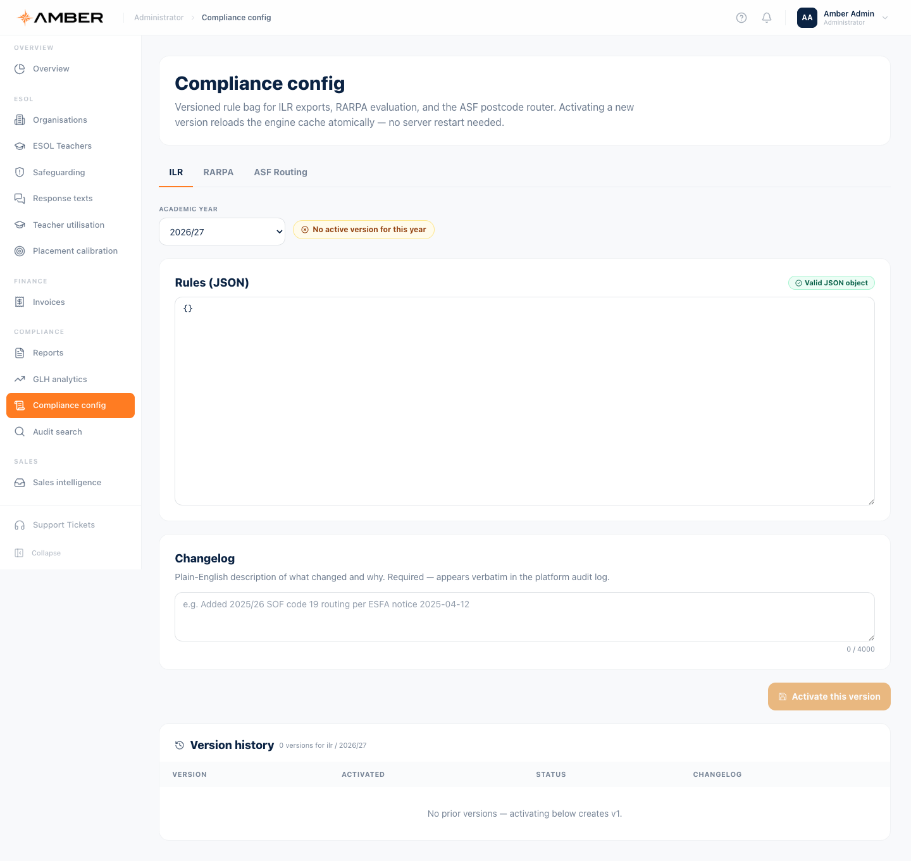

**Step by step, activating a new rule version**

1. Pick the tab: **ILR**, **RARPA**, or **ASF Routing**.
2. Pick the academic year. A badge warns when the year has no active
   version, as in the picture.
3. Edit the rules JSON. The badge above the editor confirms whether
   the JSON is currently valid; you cannot activate an invalid
   object.
4. Write the changelog. This is required, in plain English, and
   appears verbatim in the platform audit log. Say what changed and
   why, for example a new SOF code routing per an ESFA notice.
5. Press **Activate this version**. The engine cache reloads
   atomically. The new rules apply immediately, with no server
   restart and no window where half the old rules and half the new
   ones apply.

**Version history** at the bottom lists every prior version with its
activation time, status, and changelog, so you can see exactly which
rules were in force on any given date. That question comes up in
audits, and this table is the answer.

**Good to know:** activating never edits an old version. Each
activation creates the next version, so the history is complete by
construction. If a new version misbehaves, activate a corrected one;
the record of the mistake stays, which is the point.

---

## 12. Audit search

**What it is for:** every compliance event across every organisation,
searchable in one place, for support questions, investigations, and
compliance reporting.

**How to get here:** sidebar, **Audit search**.

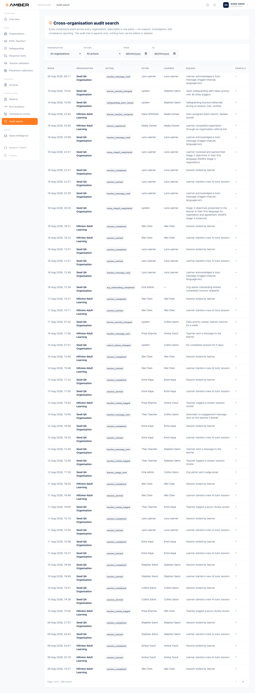

Each event shows when it happened, the organisation, the action, the
actor, the learner affected, a plain English reason, and the
compliance config version in force at the time. You can watch a
learner's whole journey here: placement completed, teacher assigned,
sessions started and ended, Stage 3 objectives negotiated, messages
acknowledged, nudges sent.

Filter by organisation, action, and date range. The trail is append
only; nothing here can be edited or deleted, by anyone, which is what
makes it usable as evidence.

---

## 13. Sales intelligence

**What it is for:** submissions from the public ROI calculator on the
marketing site, ordered so outstanding leads surface first.

**How to get here:** sidebar, **Sales intelligence**.

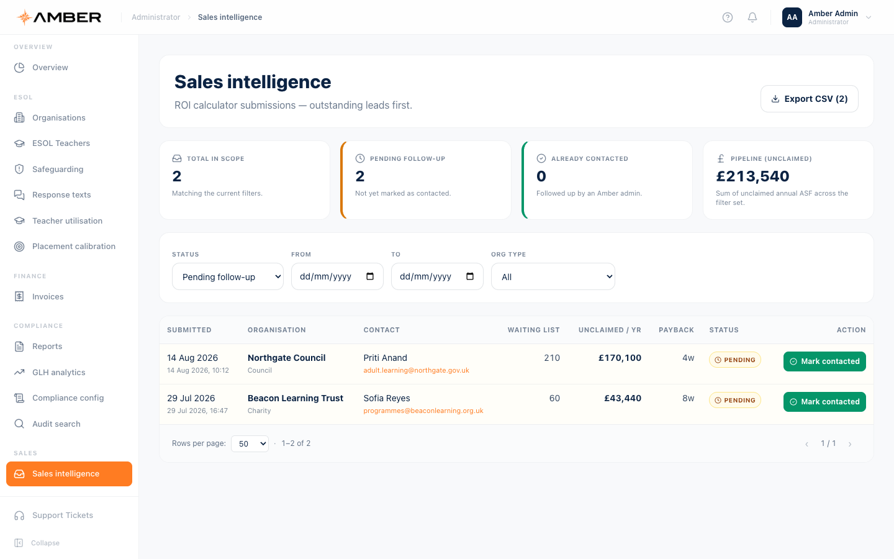

The cards count submissions in scope, pending follow up, and already
contacted, plus the unclaimed funding pipeline across the current
filter. Each row carries the organisation, contact, waiting list size,
unclaimed funding per year, and payback estimate. Mark a lead
contacted from its row, and export the current view as CSV.

---

## 14. Queues and failed jobs, the machinery

**What it is for:** the platform does its heavy work in background
queues: grading session turns, compiling RARPA evidence, generating
ILR exports, validating compliance artefacts, pushing to client MIS
systems, sending notifications, and more. These two screens are how
you check that machinery is healthy.

**How to get here:** sidebar, **Queues** (the sidebar shows this
under the platform section).

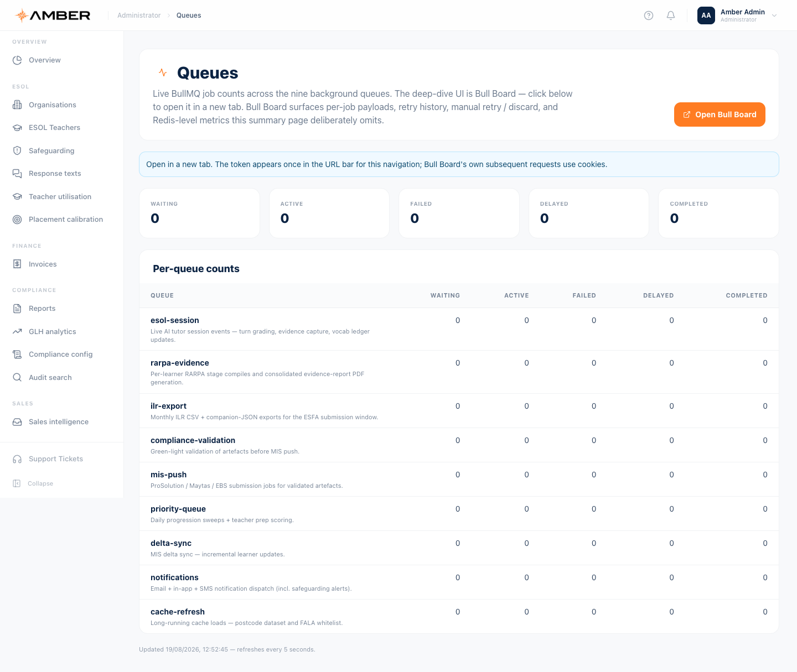

The summary shows live counts per queue: waiting, active, failed,
delayed, and completed. The row descriptions say what each queue does,
so an unhealthy number points straight at the affected feature. For a
deeper look, **Open Bull Board** opens the full queue UI in a new
tab, with per job payloads, retry history, and manual controls.

### Failed jobs

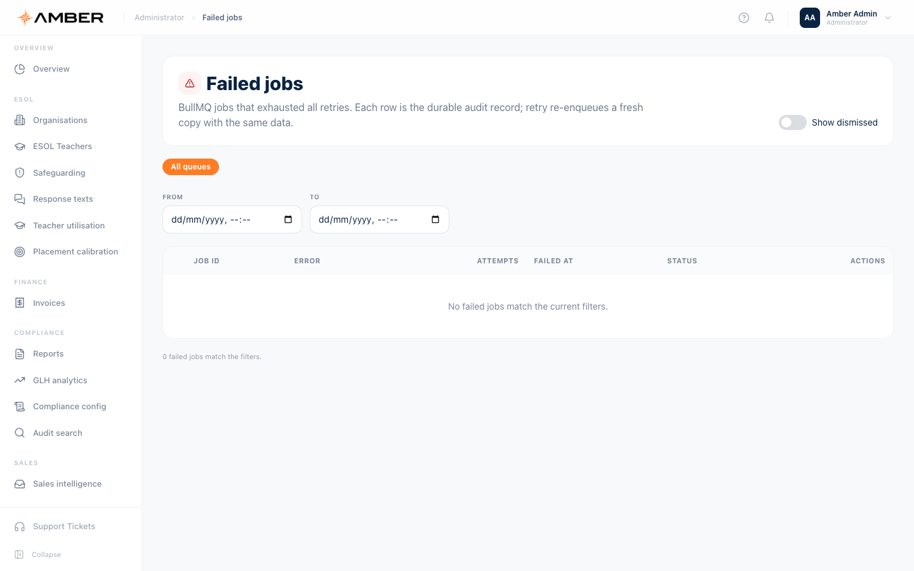

A job lands here only after exhausting all its automatic retries.
Each row is the durable audit record of that failure: the queue, the
job, the error, attempts, and when it failed.

**Step by step, working a failure**

1. Read the error. Filter by queue and date to see whether it is one
   off or a pattern.
2. Press retry on the row. Retrying enqueues a fresh copy of the job
   with the same data; the failure record itself stays, so the
   history is never rewritten.
3. If the job should not run again, dismiss it. Dismissed rows stay
   available under the **Show dismissed** toggle.

**Treat notification queue failures as urgent.** The notifications
queue carries safeguarding alert emails among other things. A failure
there is not a technical detail; until it is retried successfully, a
safeguarding lead may not know an alert exists. Check the failed jobs
screen as part of acting on any safeguarding incident, and retry
notification failures first.

---

## 15. Amber admin on your phone

The admin module works at phone size, with the sidebar folded into
the menu button:

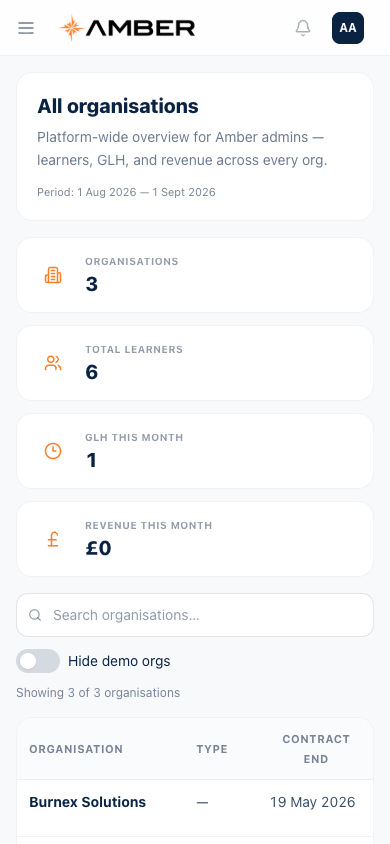

---

## 16. If something goes wrong

| Problem                                    | What to do                                                                                                                                         |
| ------------------------------------------ | -------------------------------------------------------------------------------------------------------------------------------------------------- |
| An organisation cannot sign in             | Check its status on **Organisations**. Deactivated organisations block sign in for all their people.                                               |
| A teacher says they cannot act on learners | Check **ESOL Teachers**. They may be unapproved or revoked.                                                                                        |
| A safeguarding alert looks stuck open      | Open it and record the true outcome. If you cannot resolve it, choose **Escalated** and note who now owns it.                                      |
| ILR numbers look wrong                     | Compare the same period in **GLH analytics**, then check **Compliance config** for which rule version was active.                                  |
| Queue counts will not load                 | The queue layer runs on Redis. If Redis is down the counts cannot load, and background work pauses until it returns.                               |
| A background feature silently stopped      | Check **Failed jobs** for that queue, fix the cause, then retry the jobs.                                                                          |
| The MIS push keeps failing                 | Open the organisation, use **Test connection**, and re enter credentials if needed. Remember saved credentials cannot be read back, only replaced. |

---

_Terms like RARPA, GLH, ILR, ULN, and Stage 5 are explained in the
[glossary](00-getting-started.md#glossary)._
