# Amber ESOL Organisation Admin Guide

_This guide is for provision leads and administrators at councils,
colleges, and charities running funded ESOL provision. It covers the
cohort dashboard, learner records, enrolment, teacher assignment, and
the approval and export flows that carry funding consequences. Every
picture comes from the real system._

> **The idea in one line:** the platform builds your ILR, RARPA, and
> ASF evidence continuously while learners practise, so month end
> becomes a download instead of a scramble. Your job is oversight and
> the approvals only a human may give.

---

## Quick reference, the 10 things you will do most

| I want to                          | Where to go                                     |
| ---------------------------------- | ----------------------------------------------- |
| See the whole cohort at a glance   | Sidebar, **Cohort dashboard**                   |
| Enrol one learner                  | Sidebar, **Invitations**, create an invite link |
| Enrol a whole cohort               | Cohort dashboard, **Import CSV**                |
| Open a learner's full record       | Press the learner's name anywhere               |
| Confirm a level achievement        | The Stage 5 review page, **Confirm and lock**   |
| Export the ILR return              | Cohort dashboard, **Export ILR**                |
| Generate the funding evidence pack | Cohort dashboard, **Funding report**            |
| Assign or change a teacher         | Sidebar, **ESOL Teachers**                      |
| Check who did what and when        | Sidebar, **Audit log**                          |
| Nudge an inactive learner          | Learner record, **Send nudge**                  |

---

## 1. First sign in

The first time an organisation admin signs in, Amber walks you through
a short onboarding built around the ROI calculator, so you can see the
funding picture for your own numbers before you start. Complete it once
and you will not see it again. After that, signing in lands you on your
dashboard.

---

## 2. The cohort dashboard

**What it is for:** your whole provision on one screen: status,
progress, compliance, and the three big actions.

**How to get here:** sidebar, **Cohort dashboard**.

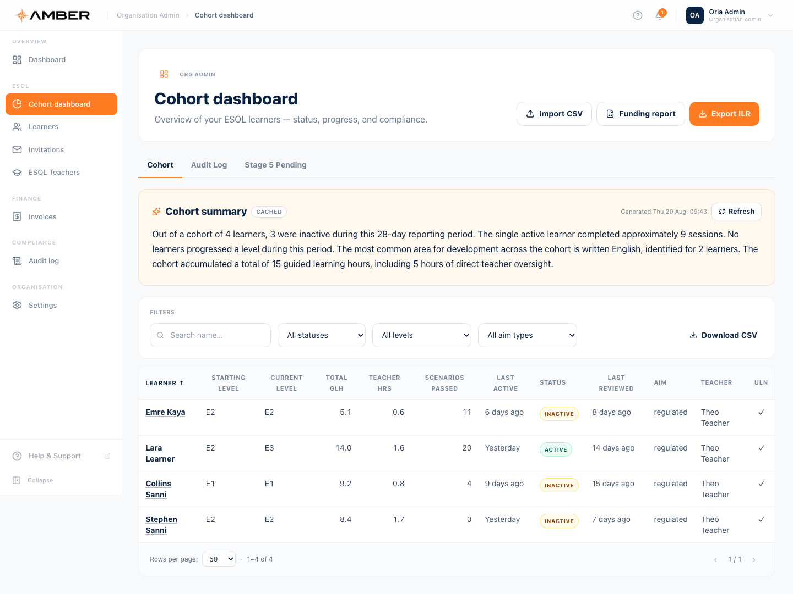

Top to bottom:

1. **The three action buttons.** Import CSV, Funding report, and
   Export ILR. Sections 8, 9, and 10 cover each in detail.
2. **Three tabs.** Cohort (this view), Audit Log, and Stage 5 Pending.
3. **Cohort summary.** A plain English narrative of the reporting
   period, written by the AI from your real data and cached. Press
   **Refresh** to regenerate it. Use it as the opening paragraph of a
   board or funder update.
4. **Filters and Download CSV.** Search by name, filter by status,
   level, or aim type. Download CSV exports the table as you filtered
   it.
5. **The cohort table.** One row per learner: starting and current
   level, **Total GLH**, **Teacher HRS**, scenarios passed, last
   active, status band, last reviewed, aim, teacher, and a ULN tick.

**Reading the hours columns, this matters for funding:**

- **Total GLH** includes AI tutor time. It shows the learner's whole
  learning volume.
- **Teacher HRS** is human contact time only.
- The learner record splits this further into AI, imported, and
  teacher hours. Only the parts your funding rules allow are ever
  claimed; AI tutor time is kept out of claims until the funder
  confirms it may count. The platform enforces this for you, so a
  bigger Total GLH never inflates a claim by itself.

**Status bands:** Active means recent practice. Inactive and Dormant
mean rising time away; those learners are candidates for a nudge or a
teacher message. **Last reviewed** showing **Never** in amber is a
prompt: no teacher has logged a review for that learner yet.

---

## 3. A learner's record

**How to get here:** press a learner's name in any table, or sidebar,
**Learners**, then the learner.

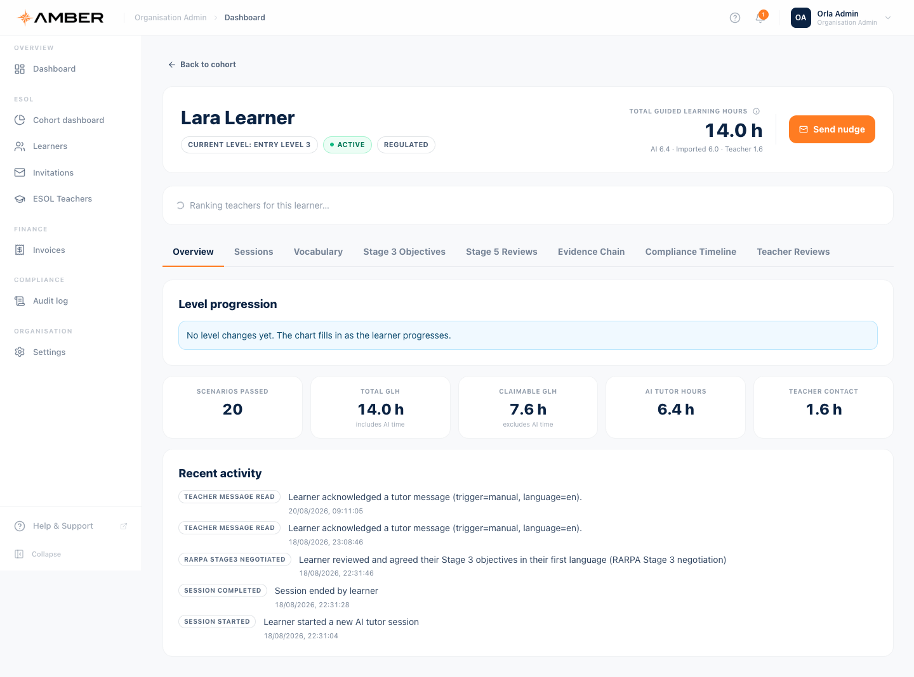

The header gives you:

- **Total guided learning hours** with the split underneath: AI,
  Imported, Teacher. This is the honest hours picture per learner.
- **Send nudge.** One press sends the learner a friendly reminder
  email. Every nudge is recorded in the audit log.
- **Suggested teachers.** Ranked by fit: level coverage, shared
  language, specialism, then workload. You decide; every assignment is
  audited.

### The eight tabs

| Tab                     | What it shows                                                                         |
| ----------------------- | ------------------------------------------------------------------------------------- |
| **Overview**            | Level history, key stats, recent activity                                             |
| **Sessions**            | Every AI session with pass results and durations                                      |
| **Vocabulary**          | Words retained and words in progress                                                  |
| **Stage 3 Objectives**  | The learner's goals, grouped by level, with source (placement, level change, teacher) |
| **Stage 5 Reviews**     | The learner's review history (see the note in section 6)                              |
| **Evidence Chain**      | The audit backbone, explained below                                                   |
| **Compliance Timeline** | Every compliance event for this learner in order                                      |
| **Teacher Reviews**     | Every review teachers have logged, with durations                                     |

### The Evidence Chain tab, your audit view

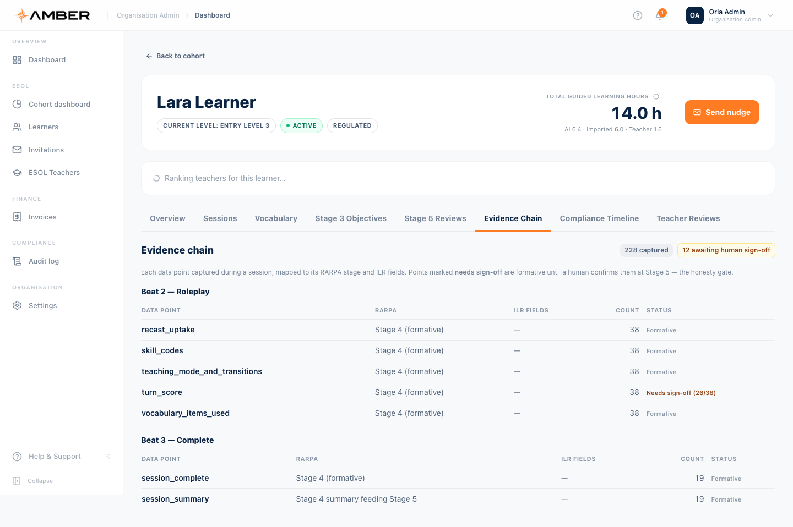

Every data point captured during a session is recorded at the moment it
happens and mapped to its RARPA stage and ILR fields. The badges at the
top count the records and, crucially, how many still **await human
sign off**.

How to read the STATUS column:

- **Formative.** Supporting evidence. It stands on its own and needs
  no approval: vocabulary used, skill codes, teaching mode changes.
- **Needs sign-off (0/2).** These rows are AI judgements, for example
  the per turn scores. They are formative until a human confirms the
  learner's achievement at Stage 5. This is the honesty gate: nothing
  the AI scores can enter a funding claim by itself.
- **Confirmed.** A human has signed off, so the record can support a
  summative claim.

If an auditor asks "where did this ILR field come from", this tab is
the answer, per learner, per session, per data point.

---

## 4. Enrolling learners one at a time, invitations

**How to get here:** sidebar, **Invitations**.

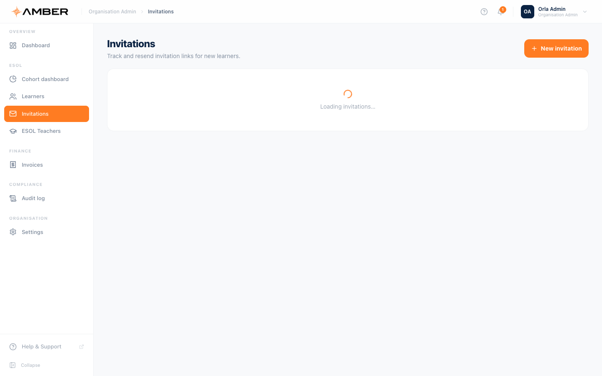

**Step by step**

1. Optionally enter the learner's email and expected level; set how
   many days the invite stays valid.
2. Press create. Amber generates a unique join link (and emails it if
   you gave an address).
3. The learner opens the link and completes the five step join form in
   their own language.
4. The table below tracks every invite: pending, used, expired. You
   can **remind** (resend) or **revoke** (cancel) any pending invite.

**Good to know:** the invite carries your organisation, so learners
who join through it land in your cohort automatically.

---

## 5. Enrolling a whole cohort, bulk import

**How to get here:** cohort dashboard, **Import CSV**, or sidebar via
the Learners area.

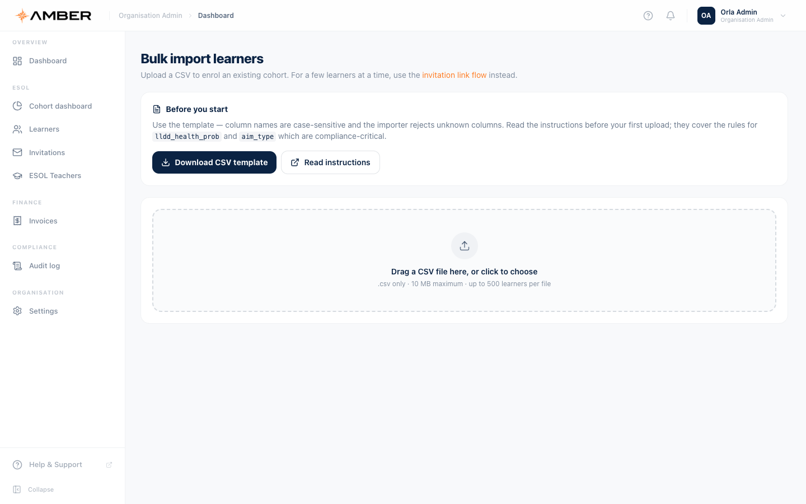

**Step by step**

1. Press **Download CSV template**. Column names are case sensitive
   and unknown columns are rejected, so always start from the
   template.
2. Press **Read instructions** before your first upload. Two columns
   are compliance critical and the instructions cover their rules:
   `lldd_health_prob` and `aim_type`.
3. Fill the template, one row per learner, up to 500 learners and
   10 MB per file.
4. Drag the file in. Amber validates **every row individually** and
   reports problems by row number, so one bad row never sinks the
   file. Rows with a postcode that needs manual funding routing import
   with a warning rather than failing.
5. Fix any reported rows and upload just the corrections.

---

## 6. Stage 5, confirming an achievement

This is the most important approval in the system, so it gets the full
treatment. **Nothing becomes an achieved outcome in your funding data
until you confirm it here.**

### The journey to your desk

1. The learner completes their level and submits a short
   **self assessment**, their own voice on their progress.
2. The AI writes a **summary of the evidence**: readiness, key
   achievements, and a plain English narrative.
3. The **teacher signs off** their side from the learner record.
4. The review then waits for **you**. Until you act, the learner's ILR
   record stays "continuing", never "achieved". The export notes call
   this a withheld achievement.

### The review page

**How to get here:** from the learner's record, or directly at the
review link in your notification.

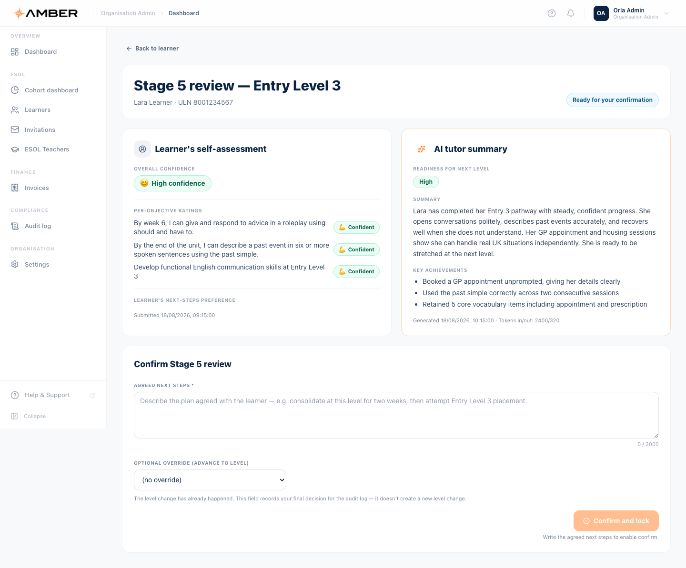

The badge in the corner tells you the state: **Ready for your
confirmation** means the self assessment and teacher sign off are in
place. The two panels give you everything you need to judge:

- **Learner's self assessment.** Overall confidence plus a rating
  against every one of their goals.
- **AI tutor summary.** Readiness for the next level, a narrative
  summary, and key achievements drawn from real sessions. This is
  advisory. You are the decision.

### Confirming

1. Write the **agreed next steps**, the plan agreed with the learner.
   This field is required; the confirm button stays disabled until you
   write it.
2. The **optional override** lets you record a different level
   decision for the audit trail. The caption explains that the level
   change itself has already happened; this field records your final
   judgement.
3. Press **Confirm and lock**.

**What happens when you confirm, all of it recorded:**

- The review is stamped with your name and the time, permanently. It
  cannot be edited afterwards, which is what makes it evidence.
- The learner's achievement becomes eligible for the ILR export as an
  achieved outcome. Before this moment the export withholds it.
- The audit log records the confirmation.

**Consider these scenarios before pressing confirm:**

- _The self assessment says low confidence but the AI says high
  readiness._ Talk to the teacher and the learner first. Confirming is
  your judgement, not a formality.
- _No teacher sign off yet._ The state badge will say so. Chase the
  teacher rather than confirming around them.
- _You disagree with the level._ Use the override field so the audit
  trail carries your decision, and speak to the teacher about the
  pathway.
- _You are not ready to decide._ Do nothing. Leaving a review pending
  is always safe; the learner keeps practising and no claim is made.

### The Stage 5 Pending tab

The cohort dashboard has a **Stage 5 Pending** tab intended to list
every review waiting for you in one place. In the current release the
list itself is still being wired up, so reviews are reached from your
notifications or the learner's record. The confirm flow itself is
fully live.

---

## 7. Teachers and assignment

**How to get here:** sidebar, **ESOL Teachers**.

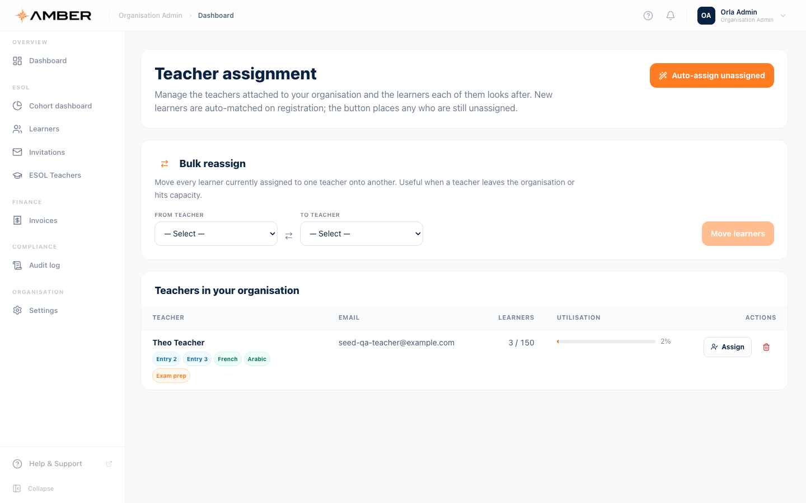

- Add teachers to your organisation and remove them when they leave.
- Assign learners to teachers. The **suggested teachers** panel on
  each learner record ranks candidates by fit; assignment is always
  your decision and always audited.
- A learner needs an assigned teacher for the priority queue,
  messaging, and reviews to work, so assign at enrolment.

---

## 8. Exporting the ILR return

**How to get here:** cohort dashboard, **Export ILR**.

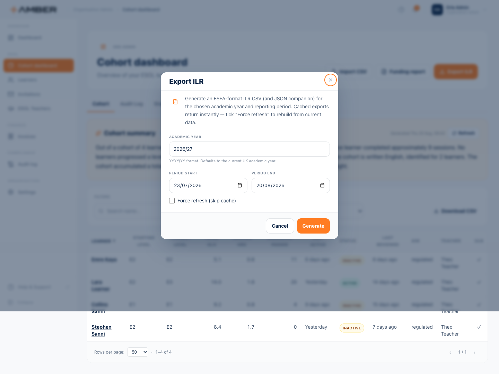

**Step by step**

1. Check the **academic year** (defaults to the current UK academic
   year) and the reporting period dates.
2. Leave **Force refresh** unticked normally. Exports are cached for
   speed; tick it only when you need the export rebuilt from this
   minute's data.
3. Press **Generate**. You receive the ESFA format CSV plus a JSON
   companion file that documents what was exported and why.

**What the export does for you, and what it refuses to do:**

- Validates every row and reports warnings rather than exporting
  silently wrong data. Rows with problems the rules can correct are
  fixed and noted; rows that cannot be exported are suppressed with a
  reason.
- **Withholds unconfirmed achievements.** A learner who passed with
  the AI but has no confirmed Stage 5 review exports as continuing,
  with a note explaining the withheld achievement. Confirm the Stage 5
  review and the next export includes the achievement.
- **Keeps AI hours out of the claim.** Claim driving hours come from
  teacher contact and imported prior learning. AI tutor time is
  reported for reconciliation but never summed into a claim, pending
  funder confirmation.

**Before you submit to the funder,** read the companion JSON's warning
list. It is your pre submission checklist.

---

## 9. The funding report

**How to get here:** cohort dashboard, **Funding report**.

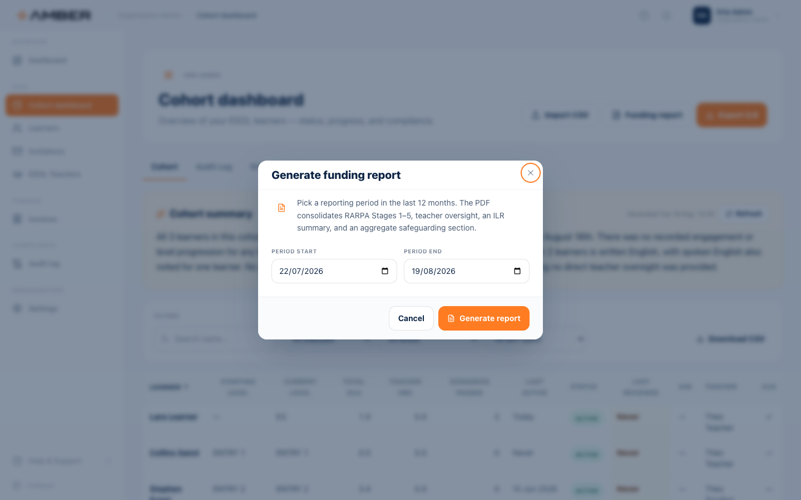

Pick a reporting period within the last 12 months and press **Generate
report**. The PDF consolidates RARPA Stages 1 to 5, teacher oversight,
an ILR summary, and an aggregate safeguarding section. This is the
document to hand an auditor or a funder alongside the ILR CSV.

---

## 10. The audit log

**How to get here:** sidebar, **Audit log**, or the Audit Log tab on
the cohort dashboard.

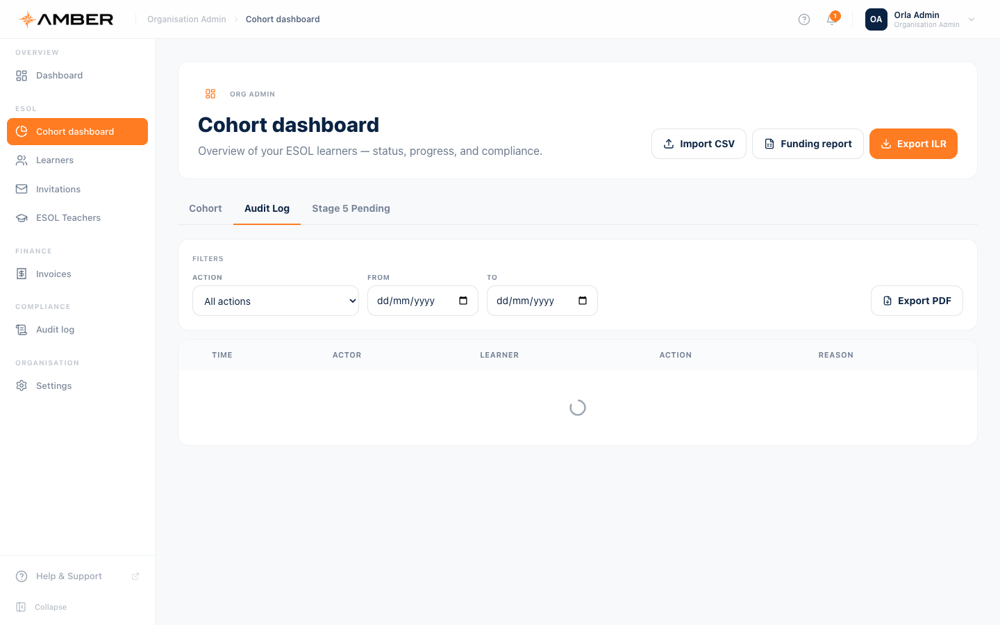

Every compliance relevant event in your organisation, in order: who,
what, when, and why. Sessions, level changes, exports, confirmations,
nudges, assignments. The log is append only. Nobody, including Amber,
can edit history. Use the search and filters to answer any "what
happened here" question without asking a developer.

---

## 11. Invoices and settings

- **Invoices** (sidebar, Invoices): your billing history with Amber.
- **Settings** (sidebar, Settings): your organisation profile.

---

## 12. Amber on your phone

The cohort dashboard works at phone size, so you can check status and
confirm reviews away from your desk:

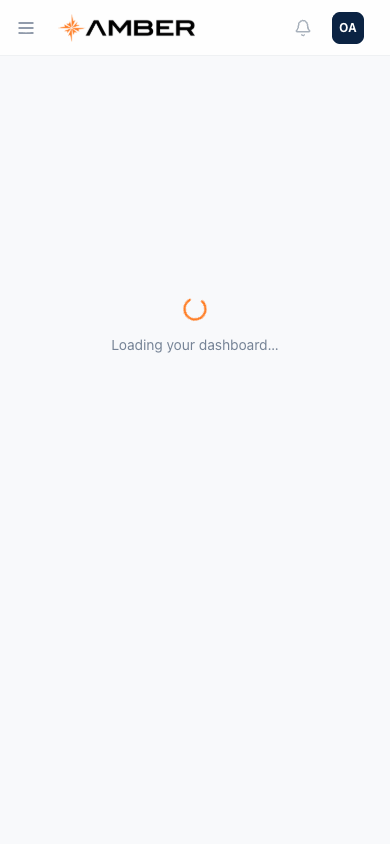

---

## 13. If something goes wrong

| Problem                                                | What to do                                                                                                                                    |
| ------------------------------------------------------ | --------------------------------------------------------------------------------------------------------------------------------------------- |
| A learner's achievement is missing from the ILR export | Almost always the Stage 5 review is unconfirmed. Open the review, confirm it, export again. The export notes name every withheld achievement. |
| The CSV import rejected my file                        | Start from the downloaded template; column names are case sensitive. Fix the rows named in the report and upload just those.                  |
| An invite expired before the learner used it           | Press remind to resend, or create a fresh invite.                                                                                             |
| The cohort summary looks out of date                   | It is cached. Press Refresh next to it.                                                                                                       |
| A learner shows Never reviewed                         | No teacher review has been logged. Check the teacher assignment and ask the teacher to log their contact.                                     |
| I confirmed a Stage 5 review by mistake                | Confirmations are permanent by design. Contact Amber support; the audit trail preserves the full history either way.                          |

---

_Terms like ILR, RARPA, GLH, and aim type are explained in the
[glossary](00-getting-started.md#glossary)._
