# Amber ESOL Teacher Guide

_This guide is for ESOL teachers. It covers your dashboard, the priority
queue, learner records, reviews, messaging, and the parts of the
compliance record that carry your name. Every picture comes from the
real system._

> **The idea in one line:** the AI tutor handles routine practice and
> the platform writes the evidence, so your time goes to the learners
> who need a human this week.

---

## Quick reference, the 8 things you will do most

| I want to                                 | Where to go                                                                |
| ----------------------------------------- | -------------------------------------------------------------------------- |
| See who needs my attention this week      | Sidebar, **Teacher Dashboard**, the priority queue                         |
| Open a learner's full record              | Dashboard, press **Open learner** on any card or row                       |
| Log a review after working with a learner | Learner page, **Log review** (this records your teaching hours)            |
| Message a learner                         | Learner page, **Send message**                                             |
| Read an AI session transcript             | Sidebar, **ESOL Sessions**, press a session                                |
| Approve a level achievement               | Learner page, **Sign off RARPA Stage 5** (active when a review is waiting) |
| Set which learners get matched to me      | Sidebar, **Teaching Profile**                                              |
| Pause the automatic nudge emails          | Dashboard, the toggle on the banner                                        |

---

## 1. Your dashboard

**What it is for:** one screen that answers the question "who needs me
this week?"

**How to get here:** sign in as a teacher. You land here. Sidebar,
**Teacher Dashboard**.

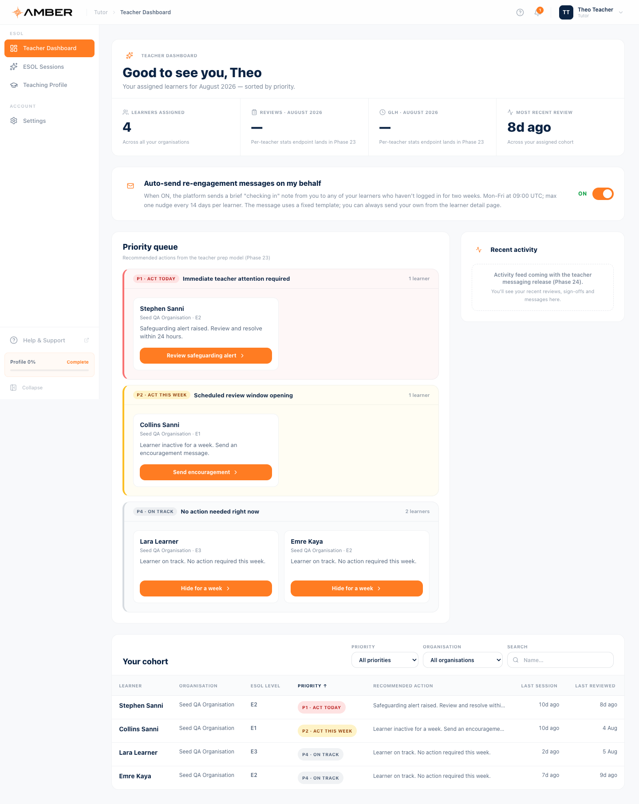

What you see, top to bottom:

1. **Your stats.** Learners assigned to you, plus reviews and teaching
   hours for the month.
2. **The nudge toggle.** When ON, Amber sends a short "checking in"
   note from you to any learner who has not signed in for two weeks.
   At most one nudge every 14 days per learner, and you can always send
   your own message instead. Turn it off any time.
3. **The priority queue.** Learners grouped into four bands. P1 means
   act now, P4 means on track, nothing needed. Each card gives the
   reason and an **Open learner** button. When everyone is on track you
   will see the whole cohort sitting in P4, as in the picture.
4. **Your cohort.** The full table with level, priority, recommended
   action, last session, and last review. Filter by priority or
   organisation, or search by name.

**Good to know:** you never need to hunt for work. If a learner needs
something, they rise into the queue with the reason attached.

---

## 2. A learner's record

**What it is for:** everything about one learner in one place, plus
every action you can take for them.

**How to get here:** press **Open learner** anywhere, or press a row in
the cohort table.

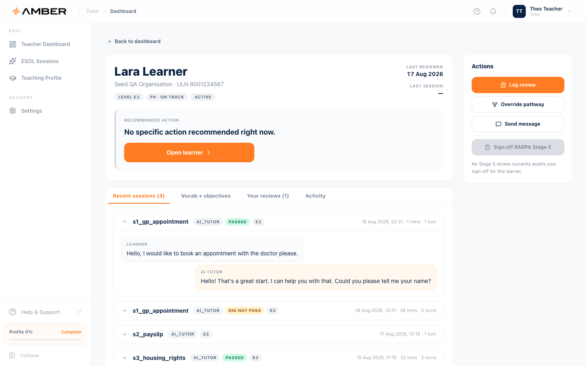

The header shows the learner's name, organisation, ULN, level badge,
priority badge, and status. Below it sits the **recommended action**
panel, and on the right the **Actions** rail:

- **Log review.** Record work you did with or about this learner
  (details in section 3).
- **Override pathway.** Hand pick the scenarios this learner should
  practise next, replacing the automatic choice for 30 days.
- **Send message.** A short note the learner sees on their dashboard
  and before their next session (section 4).
- **Sign off RARPA Stage 5.** Greyed out until a Stage 5 review is
  waiting for you. The caption underneath always explains why.

### The four tabs

**Recent sessions.** The learner's last AI tutor sessions as
collapsible cards. Open one to read the conversation exactly as it
happened, with pass results and duration.

**Vocab and objectives.** The words the learner has retained and the
words still in progress, plus their Stage 3 goals with progress notes
against each one.

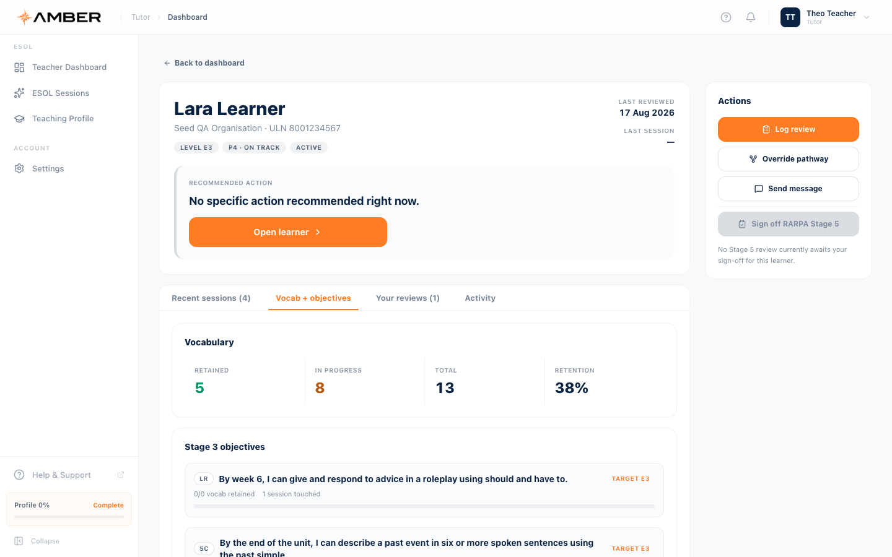

**Your reviews.** Every review you have logged for this learner,
newest first. Reviews cannot be edited after saving, so the record
stands as written.

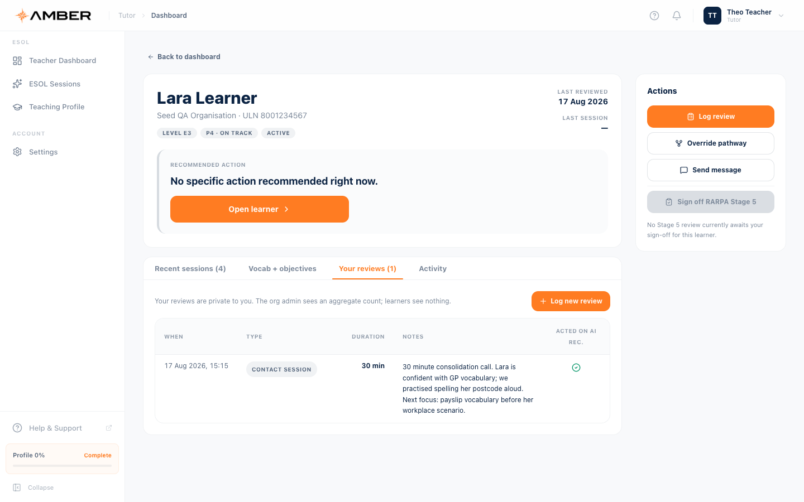

**Activity.** The learner's compliance trail: sessions started and
completed, goals agreed, messages read. This list is append only. You
cannot edit history, and neither can anyone else. That is what makes it
evidence.

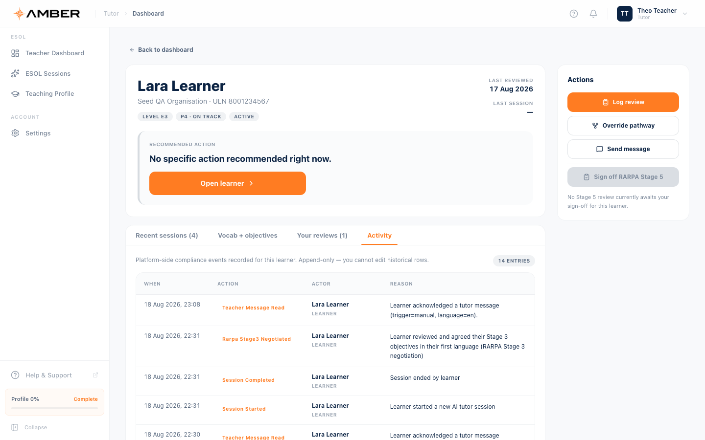

---

## 3. Logging a review

**Why this matters:** your reviews are the human teaching record. They
also count your contact time, which feeds the organisation's funding
evidence. If you worked with a learner and did not log it, the system
does not know it happened.

**How to get here:** learner page, **Log review**.

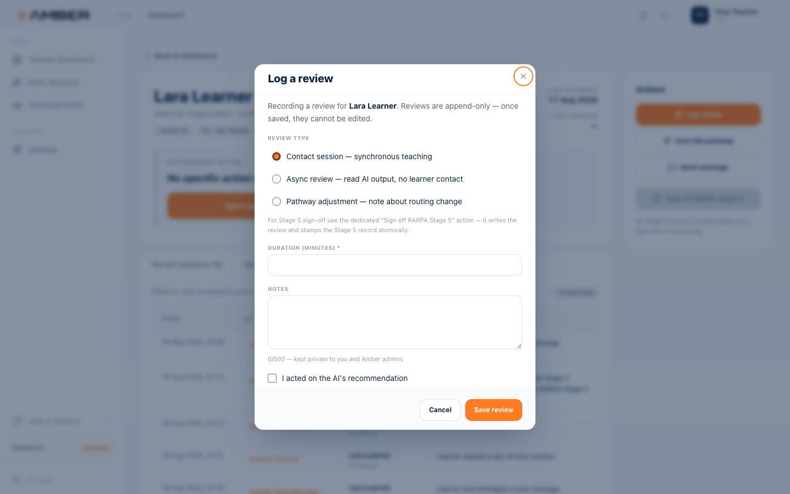

**Step by step**

1. Pick the review type:
   - **Contact session** for live teaching time with the learner.
   - **Async review** when you read their AI sessions without contact.
   - **Pathway adjustment** when you changed their scenario route.
2. Enter the duration in minutes. For contact sessions this adds to
   your recorded teaching hours.
3. Write your notes. They stay private to you and Amber admins, and
   they cannot be edited later.
4. Tick the box if you acted on the AI's recommendation.
5. Press **Save review**.

**Good to know:** Stage 5 approvals have their own dedicated action.
Use **Sign off RARPA Stage 5** for those rather than a plain review, so
the review and the Stage 5 record are stamped together.

---

## 4. Messaging a learner

**How to get here:** learner page, **Send message**.

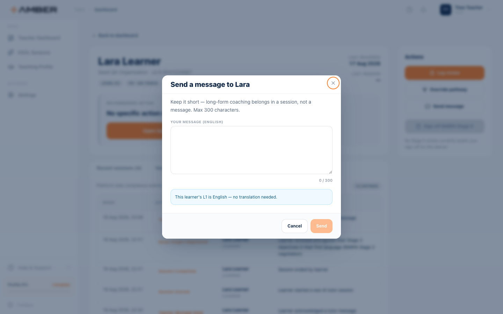

Messages are short on purpose, at most 300 characters. Long coaching
belongs in a session. When a learner's first language is not English,
Amber offers a translation preview so the learner receives the note in
their own language. The learner sees your message on their dashboard
banner and as a full screen note before their next practice session,
so it cannot be missed.

---

## 5. ESOL sessions

**What it is for:** the sessions of your assigned learners, across your
whole cohort, in one list.

**How to get here:** sidebar, **ESOL Sessions**.

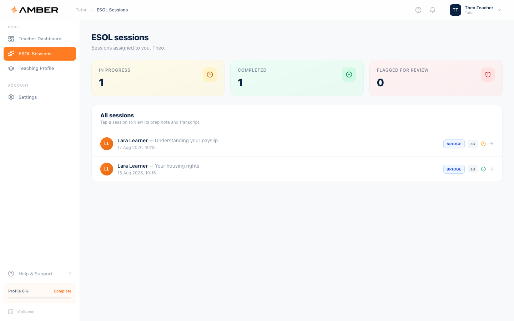

The three cards count sessions in progress, completed, and flagged for
review. Press any session to open its detail:

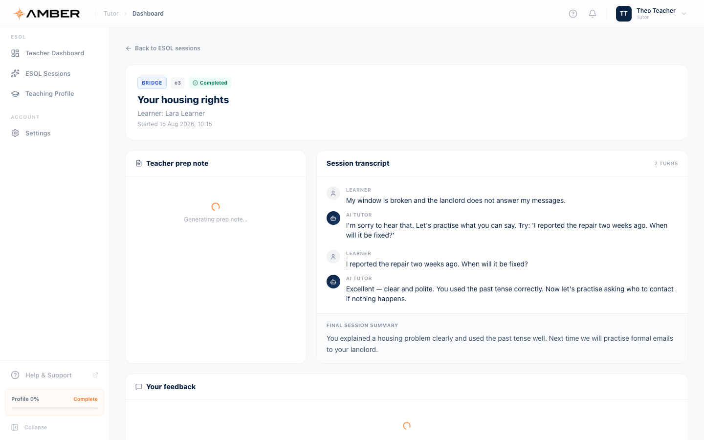

The detail view gives you:

- **The transcript.** Every learner message and every AI reply, exactly
  as the learner saw them.
- **The final session summary.** The AI's closing note to the learner.
- **A teacher prep note.** A short AI generated briefing about what
  happened and what to focus on. It generates on first open, so give it
  a few seconds.
- **Your feedback.** Space for your own comment on the session.

---

## 6. Your teaching profile

**What it is for:** this profile drives which learners get matched to
you automatically.

**How to get here:** sidebar, **Teaching Profile**.

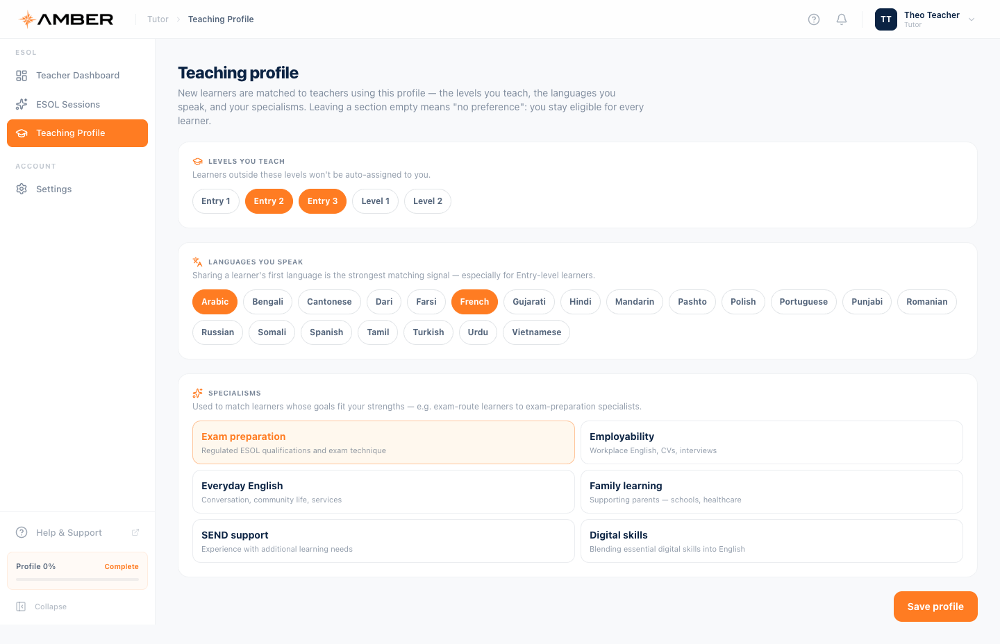

Three sections, all optional:

1. **Levels you teach.** Learners outside these levels will not be
   auto assigned to you.
2. **Languages you speak.** Sharing a learner's first language is the
   strongest matching signal, especially for Entry level learners.
3. **Specialisms.** Exam preparation, employability, everyday English,
   family learning, SEND support, digital skills. Learners whose goals
   fit your strengths come to you first.

Leaving a section empty means no preference: you stay eligible for
every learner. Press **Save profile** when done.

---

## 7. Stage 5, approving an achievement

When a learner completes a level, the platform prepares a **Stage 5
review**. Nothing the AI scores can be exported as an achievement on
its own. A human must confirm it, and for your part that is the
**Sign off RARPA Stage 5** action on the learner page.

- The button stays greyed out until a review actually awaits you, and
  the caption explains the current state.
- Signing off writes your review and stamps the Stage 5 record in one
  step, into the append only audit trail.
- The organisation admin then completes the final confirmation. Only
  after that does the achievement enter the funding record.

This two person rule is deliberate. It keeps the evidence honest and
audit safe, and it keeps a person, not a model, at the moment of
judgement.

---

## 8. Amber on your phone

The dashboard and every learner page work at phone size:

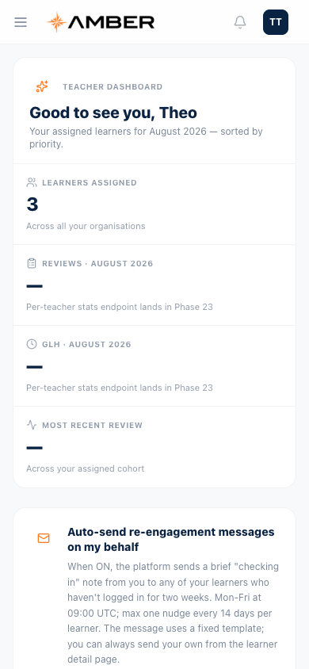

---

## 9. If something goes wrong

| Problem                                          | What to do                                                                                      |
| ------------------------------------------------ | ----------------------------------------------------------------------------------------------- |
| A learner is missing from my cohort              | Their organisation assigns learners to teachers. Ask the org admin.                             |
| The Stage 5 button is greyed out                 | No review is waiting. The caption under the button says so.                                     |
| A session shows a spinner instead of a prep note | It is generating. Give it a few seconds and it fills in.                                        |
| I logged a review with a typo                    | Reviews are append only and cannot be edited. Log a short follow up review with the correction. |
| The dashboard shows empty cards                  | It is still loading, or no learners are assigned yet.                                           |

---

_Terms like RARPA, GLH, and Stage 5 are explained in the
[glossary](00-getting-started.md#glossary)._
