# Amber ESOL — Learner Guide

_This guide is for you — the learner. It shows you every screen and
every step. The pictures are from the real system._

> **Reading tip:** every section follows the same shape — what the
> screen is for, how to get there, what you see, and what to press.

---

## Quick reference — the 8 things you'll do most

| I want to…                        | Where to go                                                        |
| --------------------------------- | ------------------------------------------------------------------ |
| Practise English with Amber       | Sidebar → **AI Tutor** → pick a scenario → **Begin roleplay**      |
| See my learning goals             | Sidebar → **My Goals**                                             |
| See the words I've learned        | Sidebar → **Vocabulary**                                           |
| Continue an unfinished session    | Sidebar → **My Sessions** → the one marked **In progress**         |
| Read a message from my teacher    | Sidebar → **Messages**                                             |
| Change the app language           | The language picker (also changes right-to-left layout for Arabic) |
| Make the text bigger in a session | The **T** button at the top of the session screen                  |
| Stop a session without losing it  | The **✕** button → **Leave for now**                               |

---

## 1. Signing in

**What it's for:** getting into your Amber account.

**How to get here:** open the Amber website and choose **Sign in**, or go
straight to `/login`.

**Step by step**

1. Type your email address.
2. Type your password.
3. Press the sign-in button.

You will land on **your dashboard**. If you have not joined yet, you
need an invitation link from your organisation — see the next section.

**If something goes wrong**

- _Wrong password_ — check it carefully; ask your teacher or
  organisation if you need it reset.
- _"Account not enrolled"_ — your organisation has not set you up for
  ESOL yet. Contact them.

---

## 2. Joining Amber (first time only)

Your organisation sends you a special **invitation link**. Opening it
starts a short, friendly form — about 5 minutes, in five steps (you can
see them across the top):

1. **Welcome** — what Amber is, in simple words. Note the language
   picker at the top right — you can read the whole form in your own
   language. Press **Start**.
2. **Your details** — your name, date of birth, nationality, and **your
   first language**. Choose the language you know best — Amber will use
   it to help you learn. You can choose English, العربية (Arabic),
   粵語 (Cantonese), or Türkçe (Turkish).

   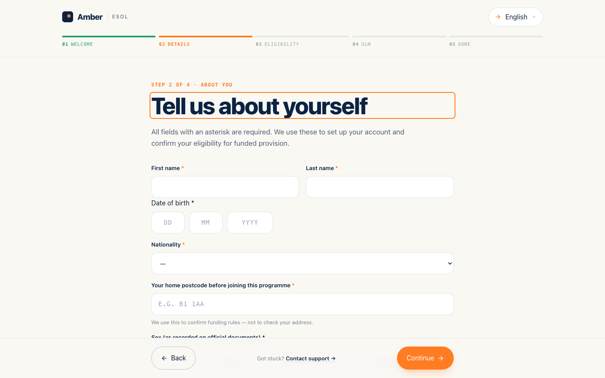

3. **Eligibility** — one declaration to confirm.
4. **ULN** — your Unique Learner Number if you know it. You can skip
   this and add it later.
5. **Done** — you're in!

**Good to know:** if you choose Arabic, the whole app flips to
right-to-left reading. You can change language later at any time.
Nothing saves until you press Continue, and you can press Back at any
step.

### Your placement assessment

The first time you sign in, Amber asks you 20 short questions to find
your **level** (from Entry 1 to Level 2). It is not a test you can fail
— it just helps Amber pick the right conversations for you.

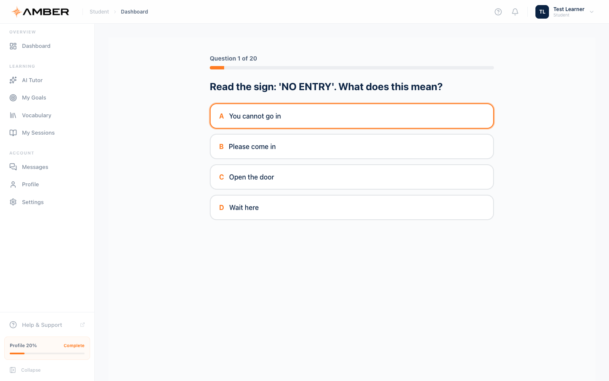

Read each question and press the answer that feels right. The orange
bar at the top shows how far you are. At the end you'll see your level
and your first learning goals. Your teacher reviews every placement, so
it can be adjusted if it feels wrong.

---

## 3. Your dashboard

**What it's for:** your home page — see your level, jump into practice,
and catch anything new.

**How to get here:** you land here after signing in. Sidebar →
**Dashboard**.

### If your teacher has written to you

A message from your teacher appears **first**, before anything else:

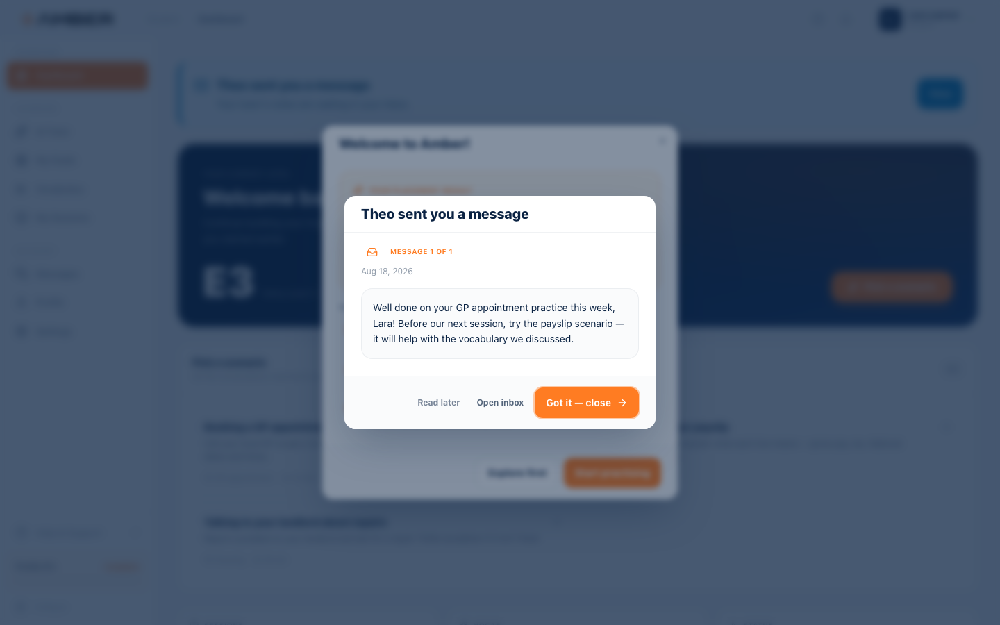

- Read it, then press **Got it — close**.
- Press **Open inbox** to see all your messages instead.
- Press **Read later** to close it for now — it stays in **Messages**.

### The welcome card (first visits)

After placement you'll see a welcome card with **your level** and three
tips for starting well:

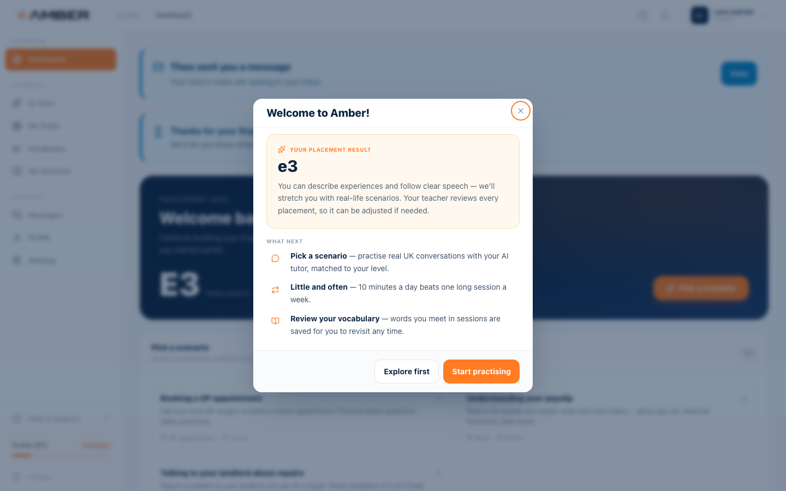

Press **Start practising** to go straight to the scenarios, or
**Explore first** to look around.

### The dashboard itself

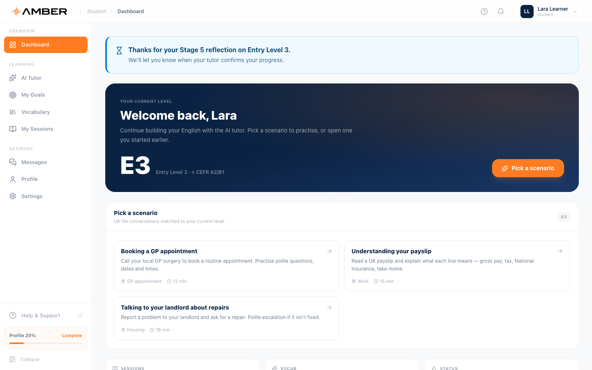

What you see:

- **Your level** (for example E3) on the big card.
- **Pick a scenario** — shortcuts into practice.
- Your **recent sessions** and **recent words**.
- A banner if you have an unread teacher message.

---

## 4. Practising with the AI Tutor

This is the heart of Amber. A practice session has **three parts**:
**Prepare** (get ready) → **Roleplay** (the conversation) →
**Complete** (see how you did).

### 4.1 Choose a scenario

**How to get here:** Sidebar → **AI Tutor**.

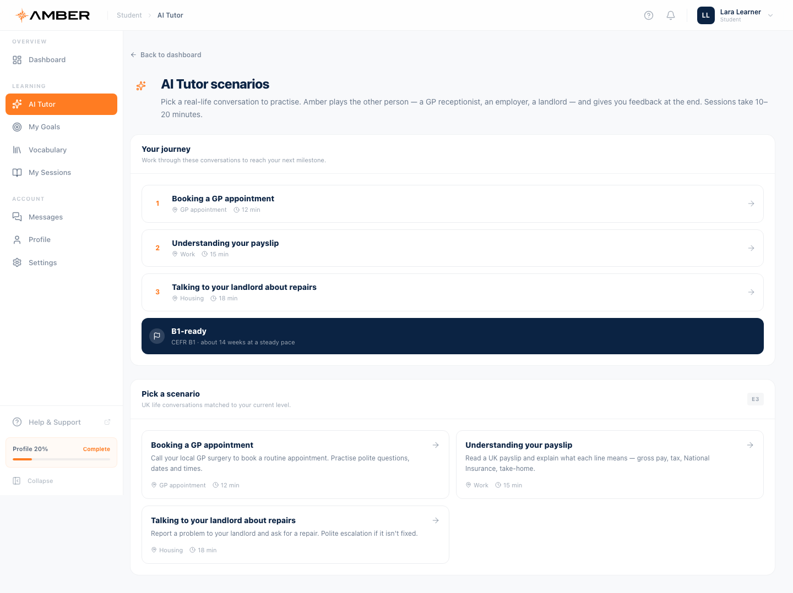

- **Your journey** shows your scenarios as a path, ending at your next
  milestone (for example **B1-ready · about 14 weeks**). Work through
  them in order — or pick any one you like.
- **Pick a scenario** below shows the same conversations as cards, all
  matched to your level.
- Each card shows the topic and about how many minutes it takes.

Press any scenario to continue.

### 4.2 Prepare

**What it's for:** see what you will practise _before_ you start — no
surprises.

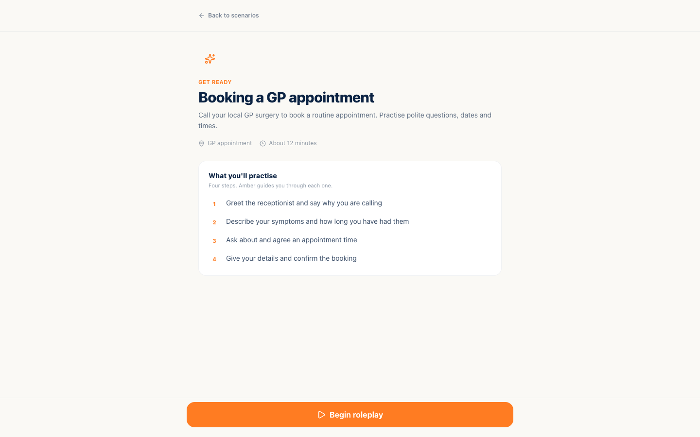

You see the situation, the UK context, roughly how long it takes, and
the **four steps** of the conversation (for example: greet the
receptionist → describe your symptoms → agree a time → confirm your
details).

Press **Begin roleplay** when you're ready.

### 4.3 The conversation

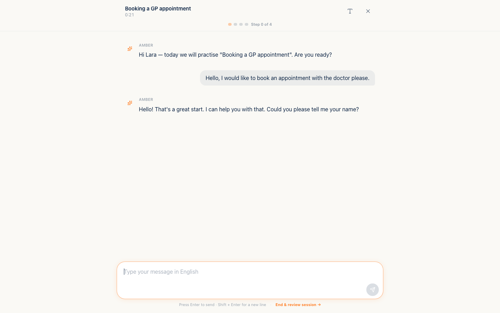

What's on this screen:

- **Top:** the scenario name and a timer.
- **The four dots** — your progress through the conversation's four
  steps. They fill up as you complete each step ("Step 1 of 4").
- **The chat** — Amber speaks first. Type your reply in the box and
  press **Enter** (or the send button).
- **T button** — makes the text bigger (three sizes).
- **✕ button** — leave the session (your progress is saved — see 4.5).

**Step by step**

1. Read Amber's message.
2. Type your answer in English — the best English you can. Mistakes
   are welcome; that's how you learn.
3. Press Enter. Amber replies in a few seconds.
4. Keep going — the dots fill as the conversation moves forward.

**Good to know**

- **If you don't understand, say so** — write "I don't understand" in
  English _or in your own language_. Amber will slow down and use more
  of your language. This is never a problem.
- If your provider has **voice** switched on, you'll also see a
  **Listen** button under Amber's messages (hear it aloud) and a
  **microphone** button (speak instead of typing). Typing always works
  too.
- After a while, a gentle banner may suggest wrapping up. You can
  dismiss it and keep going — it never stops you.

### 4.4 Finishing — your results

End a session in either way:

- finish the conversation naturally, or
- press **End & review session →** under the message box.

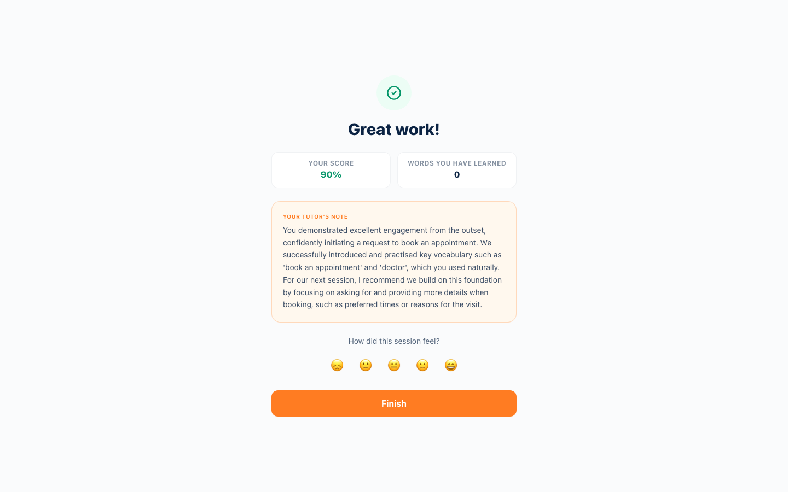

You see:

- **Your score** for the session.
- **Words you have learned.**
- **Your tutor's note** — what you did well and what to practise next.
- The emoji row — tell us how the session felt (one tap).

Press **Finish** to go back to your dashboard. You'll hear a soft chime
— well done!

### 4.5 Leaving early and coming back

Press **✕** during a session and you'll see this:

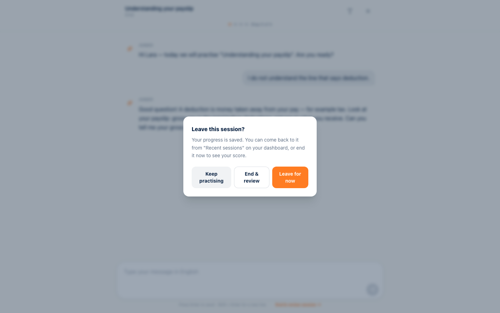

- **Leave for now** — closes the session and _saves everything_. You
  can come back any time.
- **End & review** — finishes the session now and shows your score.
- **Keep practising** — changes nothing; back to the chat.

To **come back later**: Sidebar → **My Sessions** → press the session
marked **In progress**. The whole conversation is restored:

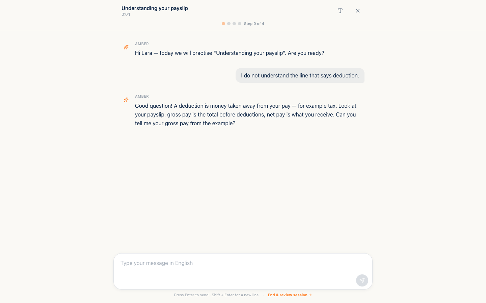

### If you write about something upsetting

If you tell Amber about something serious — feeling unsafe, being hurt,
or feeling very low — the practice pauses and Amber shows you a calm
message **in your language** with real places that can help. A trusted
person at your organisation is told, so a human can support you. You
are never in trouble for saying how you feel.

---

## 5. My Goals

**What it's for:** the learning goals set after your placement — check
they feel right, and agree them.

**How to get here:** Sidebar → **My Goals**.

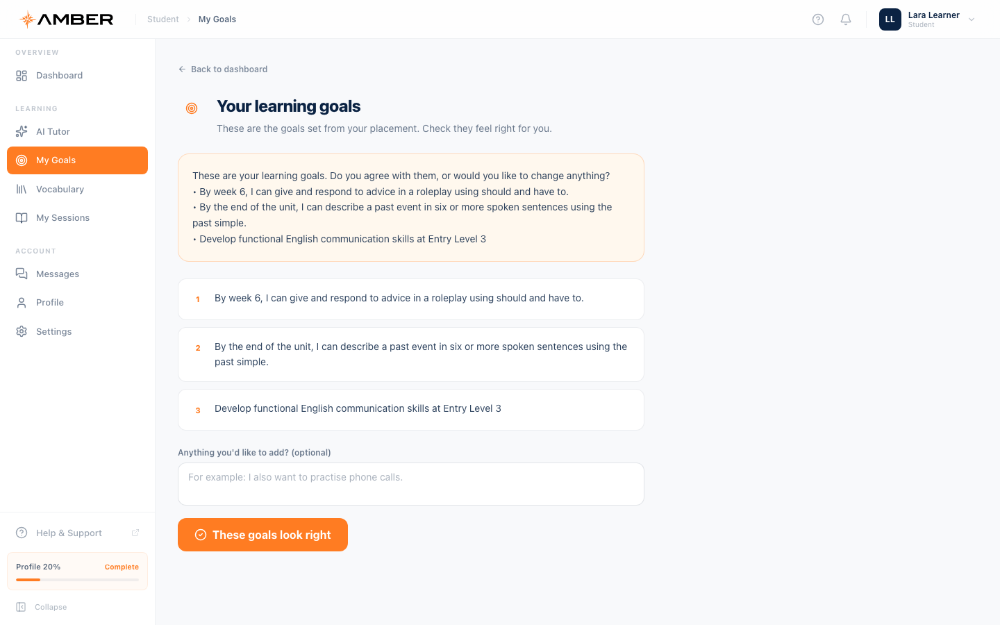

**Step by step**

1. Read the goals — they're written for your level.
2. (Optional) add anything you'd like in the box — for example, "I also
   want to practise phone calls."
3. Press **These goals look right**.

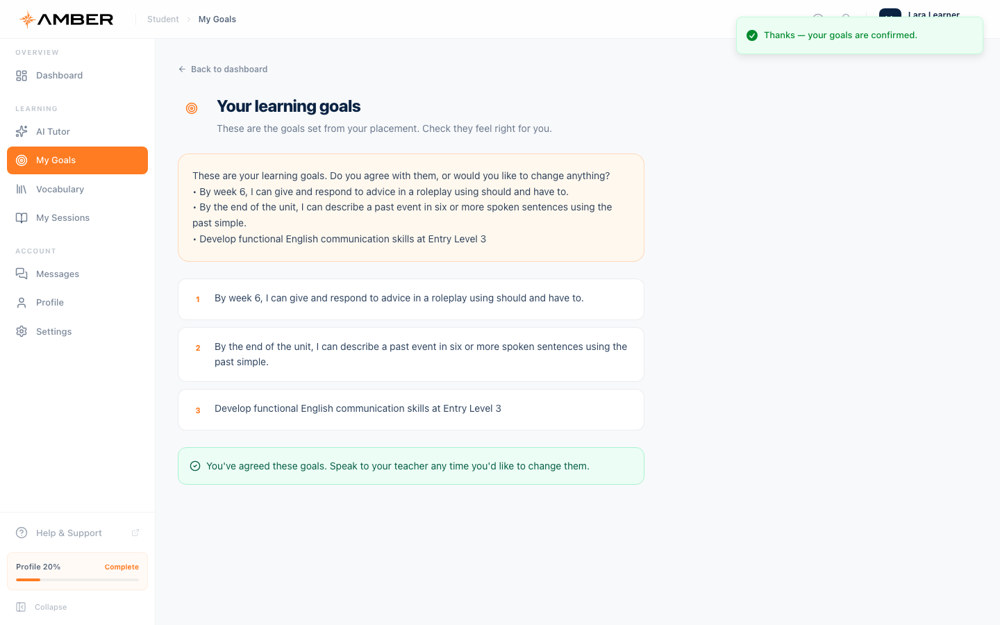

**Good to know:** agreeing your goals is recorded — it's part of your
official learning record. Want to change them later? Speak to your
teacher any time.

---

## 6. Vocabulary

**What it's for:** every word you meet in sessions is saved here so you
can revisit it.

**How to get here:** Sidebar → **Vocabulary**.

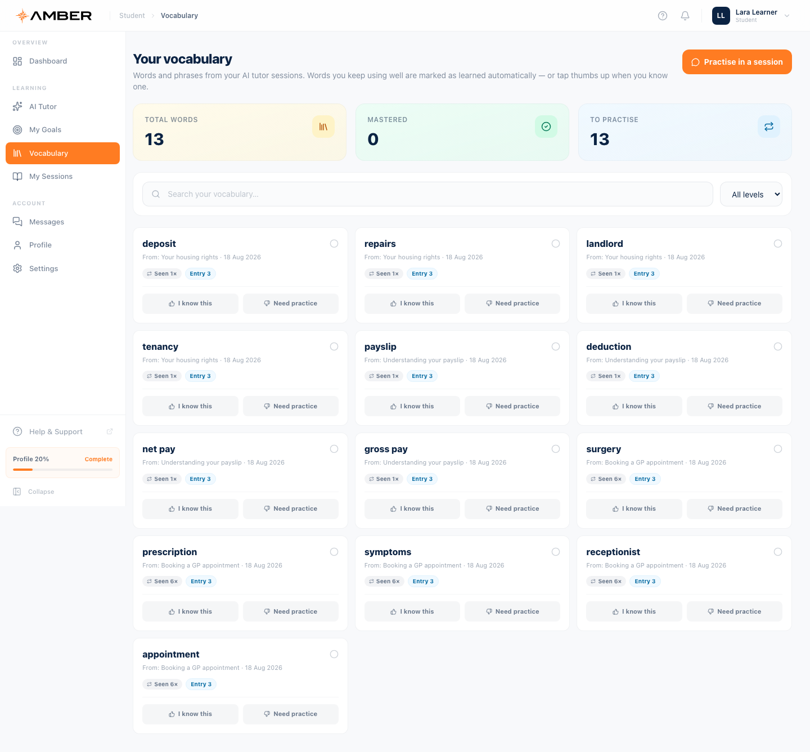

What you see:

- **Total words · Mastered · To practise** at the top.
- One card per word: which scenario it came from, when, and how many
  times you've seen it.
- **I know this** / **Need practice** — tap to tell Amber. Words you
  keep using well become "learned" automatically too.
- Search and level filter at the top.

Amber quietly brings your "to practise" words back into future
conversations — that's how they stick.

---

## 7. My Sessions

**What it's for:** every session you've ever started, newest first.

**How to get here:** Sidebar → **My Sessions**.

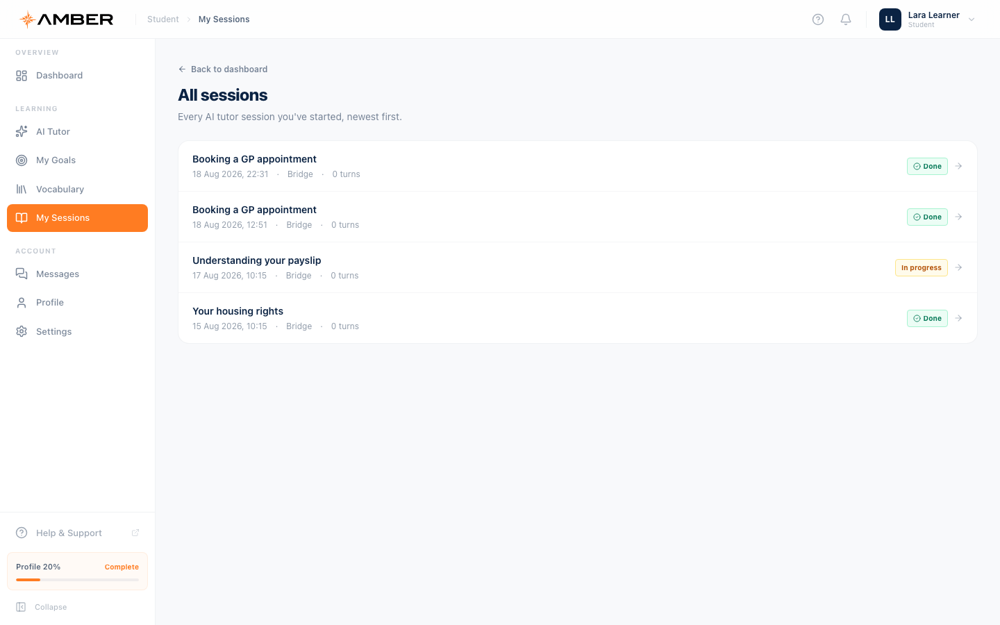

- **Done** — finished sessions. Press one to re-read the whole
  conversation (you can't type in a finished session).
- **In progress** — press to continue where you left off.

---

## 8. Messages

**What it's for:** notes from your teacher, in your language.

**How to get here:** Sidebar → **Messages**.

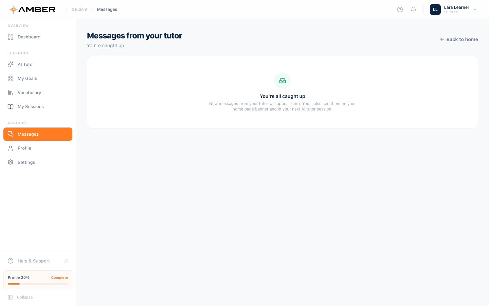

New messages also appear as a banner on your dashboard — and Amber
makes sure you see them before your next session. When there's nothing
new, you'll see "You're all caught up."

---

## 9. Your language (and right-to-left)

Choose your language when you join — or change it later. If you use
Arabic, every screen flips to right-to-left automatically, including
the session screen:

---

## 10. Amber on your phone

Everything works on a phone — same features, same account:

| Dashboard                                                       | Prepare                                                            |
| --------------------------------------------------------------- | ------------------------------------------------------------------ |
| 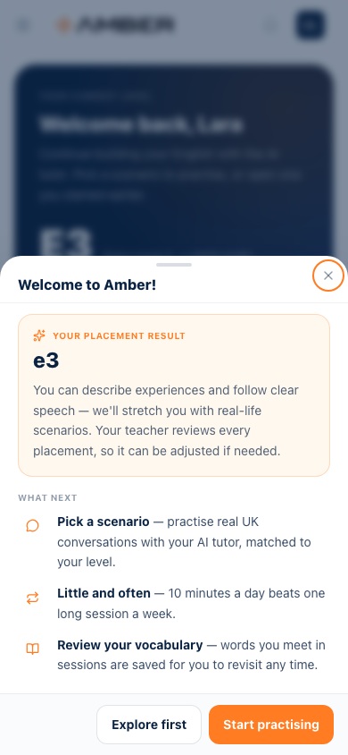 | 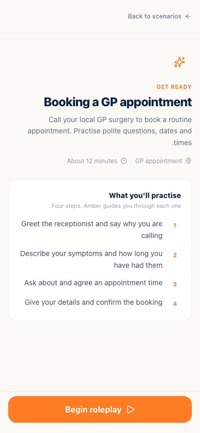 |

**Tip:** the text boxes won't zoom your screen when you tap them — type
comfortably.

---

## 11. If something goes wrong

| Problem                                        | What to do                                                           |
| ---------------------------------------------- | -------------------------------------------------------------------- |
| Amber says "Sorry — I didn't quite catch that" | Nothing is broken — just say your message again.                     |
| The page won't load                            | Check your internet, then refresh. Your session is saved.            |
| I closed the app mid-session                   | Open **My Sessions** → your session is there marked **In progress**. |
| I can't sign in                                | Ask your teacher or organisation to check your account.              |
| I sent a message by mistake                    | It's fine — just keep going, or leave the session.                   |

---

## 12. Stage 5 — your own assessment

When you finish a level, your teacher starts a **review**. Part of it is
**your voice**: a short self-assessment where you say how you feel about
your progress. You'll see a card on your dashboard when it's your turn —
press it and answer honestly. Your teacher and organisation confirm the
level together with you.

---

_Words like "placement", "level", and "scenario" are explained in the
[glossary](00-getting-started.md#glossary)._
